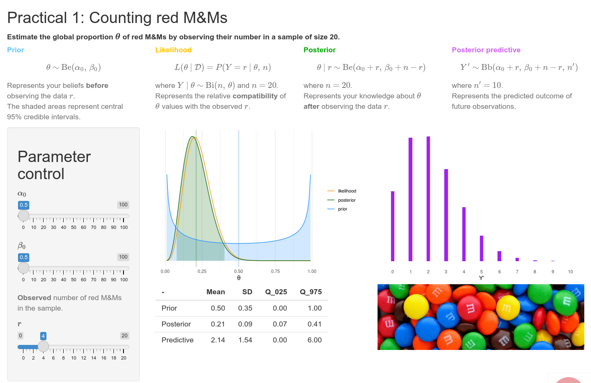

<!-- README.md is generated from README.Rmd. Please edit that file -->

```{r, include = FALSE}
knitr::opts_chunk$set(
  collapse = TRUE,
  comment = "#>",
  fig.path = "man/figures/README-",
  out.width = "100%"
)
```

# vibass
[`r htmltools::img(src = "http://vabar.es/images//widget_vibass8.png", width = "300px")`](http://vabar.es/events/vibass8/)

<!-- badges: start -->
[](https://github.com/VABAR/vibass/actions)
[](https://CRAN.R-project.org/package=vibass)
[](https://vabar.r-universe.dev/vibass)
<!-- badges: end -->

Teaching materials for the [introductory course on Bayesian inference](http://vabar.es/events/vibass8-intro/) at [VIBASS](http://vabar.es/events/vibass8/)


## Installation

Install the released version of `vibass` from CRAN:
```{r install-cran, eval = FALSE}
install.packages('vibass')
```

Or install the development version from our [`r-universe`](https://vabar.r-universe.dev/vibass) with:
```{r install-r-universe, eval = FALSE}
install.packages('vibass', repos = c('https://vabar.r-universe.dev', 'https://cloud.r-project.org'))
```

## Example

If installed with vignettes, the package contains the course practicals.
Otherwise, it points to the corresponding articles in the web site 
[http://vabar.es/vibass/](http://vabar.es/vibass/).

Most importantly, it contains interactive apps associated with some of the 
practicals

```{r example, eval = FALSE}
library(vibass)

## If installed with vignettes:
## Otherwise, read at: http://vabar.es/vibass/
browseVignettes('vibass')  # Index of all practicals
vignette('p1')  # Open practical

vibass_app()    # Lists available apps
vibass_app(1)   # Launch the interactive app for practical 1
```


