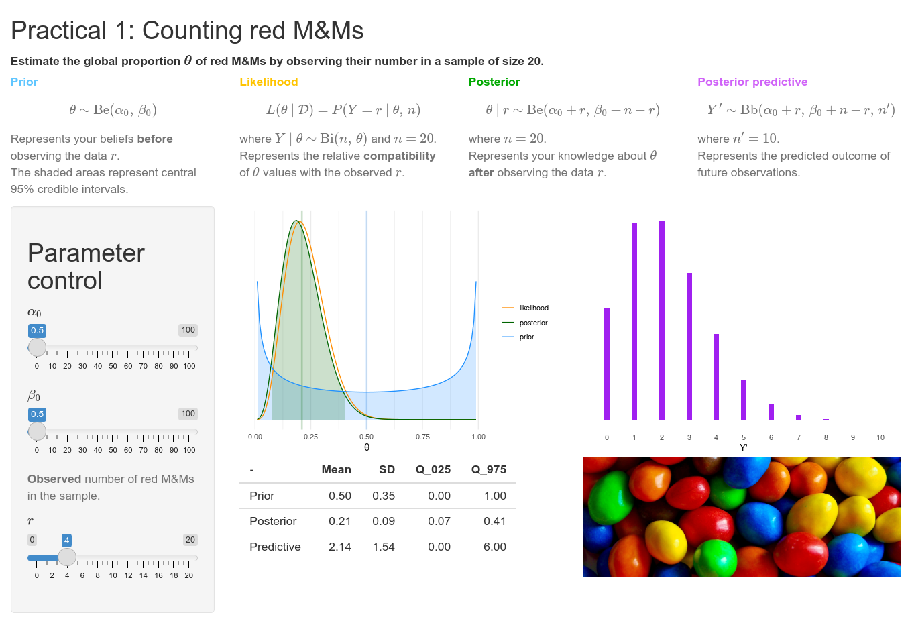

<!-- README.md is generated from README.Rmd. Please edit that file -->

```{r, include = FALSE}
knitr::opts_chunk$set(
  collapse = TRUE,
  comment = "#>",
  fig.path = "man/figures/README-",
  out.width = "100%"
)
```

# vibass
[`r htmltools::img(src = "http://vabar.es/images//widget_vibass4.png", width = "300px")`](http://vabar.es/events/vibass4/)

<!-- badges: start -->
<!-- badges: end -->

Teaching materials for the [introductory course on Bayesian inference](http://vabar.es/events/vibass4-intro/) at [VIBASS](http://vabar.es/events/vibass4/)


## Installation

```{r install, eval = FALSE}
# install.packages("remotes")
remotes::install_github("VABAR/vibass", build_vignettes = TRUE)
```

## Example

The package contains the course practicals and associated interactive apps

```{r example, eval = FALSE}
library(vibass)
vignette("p1")  # Open practical 1
vibass_app(1)  # Launch the interactive app for practical 1
```


