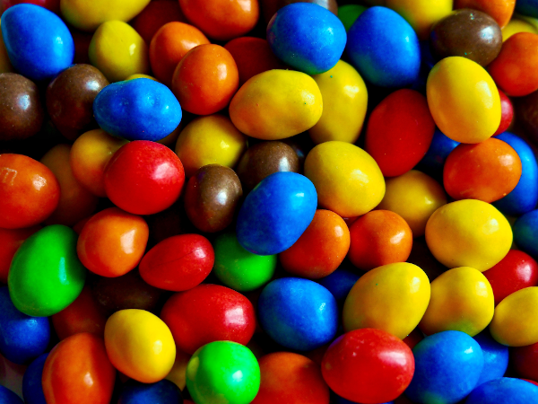

```{r setup, include=FALSE}
knitr::opts_chunk$set(
  echo = TRUE,
  collapse = TRUE,
  comment = "#>"
)
pacman::p_load(
  colorspace,
  cowplot,
  dplyr,
  extraDistr,
  ggplot2,
  hrbrthemes,
  knitr,
  magrittr,
  png,
  tibble,
  tidyr,
  waffle
)

```

 

 
# Introducing  M$\&$M's

According to Wikipedia: 

> M&M's are multi-colored button-shaped chocolates, each of which has the letter "m" printed in lower case in white on one side, consisting of a candy shell surrounding a filling which varies depending upon the variety of M&M's. The original candy has a semi-sweet chocolate filling which, upon introduction of other variations, was branded as the "plain, normal" variety.  
>
> The candy originated in the United States in 1941. They are produced in different colors, some of which have changed over the years. The candy-coated chocolate concept was inspired by a method used to allow soldiers in the Spanish Civil War (1936–1939)  to carry chocolate in warm climates without it melting.  A traditional milk chocolate M&M weighs about 0.91 grams and has about 4.7 calories  of food energy''.
 
```{r fig.cap = cap, echo = FALSE, fig.align='center'}
cap <- "A pile of peanut M&M's candies. Photo by Victor Roda."

```


#  Bayesian inference for the proportion of red M$\&$M's


##  The experiment: Counting red M$\&$M's

Let's start this practical session by making inference about the proportion of red M$\&$M's in a very huge box. If you are following this practice in person, the instructor will give you a bag of M$\&$M's to make the practice more fun even if we have to be a bit flexible about the theoretical conditions of the experiment.  If you are working  online  it will be a bit more boring but we will comply better with the theoretical  conditions of the experiment. 


```{r sampling-process, fig.cap = cap, echo = FALSE, fig.width=9, fig.height = 4}
cap <- "Representation of the sampling experiment."
## Generates a bunch of M&Ms
# set.seed(20210519)
# tibble(
#   x = runif(1e3),
#   y = runif(1e3)
# ) %>% 
#   ggplot(aes(x, y)) +
#   geom_point(
#     colour = sample(vibass:::mm_cols, 1e3, replace = TRUE)
#   ) +
#   coord_fixed() +
#   theme_void()
## Manually edit the image with GIMP for blur effects on wiggly boundaries. Save into mm_bag.png.
mm_bag <- png::readPNG("mm_bag.png")

sample_dat <- 
  expand_grid(
    x = 1:5,
    y = 1:4
  ) %>% 
  mutate(
    red = x == 1
  )


p <-
  sample_dat %>% 
  ggplot(aes(x, y)) +
  geom_point(
    aes(colour = !red),
    size = 20,
    show.legend = FALSE
  ) +
  geom_curve(
    data = tribble(
      ~x, ~y, ~xend, ~yend,
      -2, 2.5, 0, 2.5,
      0, 1.5, .4, 2
    ),
    aes(xend = xend, yend = yend),
    colour = "grey75",
    size = .5,
    curvature = -.1,
    arrow = arrow(length = unit(0.01, "npc"), type = "closed")
  ) +
  annotate(
    "text",
    x = 0, y = 1.3,
    label = "Red M&Ms: 4",
    hjust = .8,
    colour = vibass:::mm_cols["red"]
  ) +
  geom_curve(
    data = tribble(
      ~x, ~y, ~xend, ~yend,
      .7, 4.5, 5.3, 4.5
    ),
    aes(xend = xend, yend = yend),
    colour = "grey75",
    size = .5,
    curvature = -.1
  ) +
  annotate(
    "text",
    x = 3, y = 5,
    label = "Sample size: 20"
  ) +
  scale_colour_discrete(type = c(vibass:::mm_cols["red"], "grey")) +
  coord_fixed(xlim = c(-6, 6), ylim = c(0, 5)) +
  theme_void()

ggdraw() +
  draw_image(mm_bag, x = -.3, y = 0) +
  draw_plot(p) +
  annotate(
    "text",
    x = .2, y = .1,
    label = "Infinite population of M&Ms"
  ) +
  annotate(
    "text",
    x = .75, y = .1,
    label = "Observed sample"
  )
```


For those of us who physically have the bag of M$\&$M's, the most appropriate experiment would be to take candies out of the bag one at a time and replace them, recording whether their colour is red or not, until the number $n$ of candies we have previously set is obtained. We consider $n$=20. 

In case you are online or you don't want to carry out the experiment physically you can use the following result of the experiment:

```{r}
data <- data.frame(MMs = 20, red = 4) 
```


## The sampling model is Binomial

Let $Y$ be the random variable that describes the number of red M$\&$M's (successes)   out of the $n=20$ sampled. Given the proportion $\theta$ of red candies in the bag,   $Y$ is a binomial random variable with parameters $n=20$ and probability $\theta$ associated  with obtaining a red candy

$$Y \mid \theta \sim \mbox{Bi}(n, \theta)$$
 
whose conditional probability function, expectation and variance are:

- $P(Y=r \mid \theta, n)=\binom{n}{r}\,\theta^r\, (1-\theta)^{(n-r)}, \,\,r=0,1,\ldots, n$ 
- $E(Y\mid \theta)=n\,\theta$, 
- $Var(Y\mid \theta)=n \theta (1-\theta)$

```{r binomial-pdfs, fig.cap = cap, fig.width = 5, fig.height = 3, echo = FALSE}
cap <- "Binomial probability function for two values of $\theta$ and $n=20$ observations."
theta_labels <- 
  tibble(
    theta = c("0.5", "0.2"),
    r = c(12, 6),
    prob = c(.18, .18),
    label = c("theta==0.5", "theta==0.2"),
    hjust = 0
  )

tibble(
  r = 0:20
) %>% 
  mutate(
    theta_0.5 = dbinom(r, 20, 0.5),
    theta_0.2 = dbinom(r, 20, 0.2)
  ) %>% 
  pivot_longer(
    cols = starts_with("theta_"),
    names_to = "theta",
    names_prefix = "theta_",
    # names_transform = list(theta = as.numeric),
    values_to = "prob"
  ) %>% 
  ggplot(aes(r, prob, fill = theta)) +
  geom_bar(
    stat = "identity",
    position = "dodge",
    width = .5,
    show.legend = FALSE
  ) +
  geom_text(
    data = theta_labels,
    aes(label = label, hjust = hjust, color = theta),
    parse = TRUE,
    show.legend = FALSE
  ) +
  labs(
    x = "Number of red M&Ms in the sample (r)",
    y = "Probability"
  ) +
  scale_fill_discrete_qualitative() +
  scale_color_discrete_qualitative() +
  theme_ipsum(grid = "Y")
```


##  A prior distribution for $\theta$

Recall that the beta distribution is conjugate with respect to the binomial probability model. If we elicit a prior beta distribution Be$(\alpha_0, \beta_0)$ for $\theta$, its density is  

$$\pi(\theta)=\frac{\Gamma(\alpha_0+\beta_0)}{\Gamma(\alpha_0)\,\Gamma(\beta_0)}\, \theta^{\alpha_0-1}\,(1-\theta)^{\beta_0-1}, \quad 0<\theta<1$$
with expectation and variance

- E$(\theta)=\alpha_0 / (\alpha_0+\beta_0)$, 
- Var$(\theta)= \alpha_0\,\beta_0 / [(\alpha_0+\beta_0)^2\,(\alpha_0+\beta_0+1)]$

We will start by working with the non-informative prior distribution Be$(\alpha_0=0.5, \beta_0=0.5)$ whose prior expectation and standard deviation is E$(\theta)=0.5$ and DT$(\theta)=0.3535$, respectively. Its   graphic  is obtained via 

```{r, fig.align='center', out.width="60%"}
theta <- seq(0, 1, 0.01)
prior <- dbeta(theta, 0.5, 0.5)
plot(
  theta, prior,
  type="l", lwd=4, col="dodgerblue", xlim=c(0, 1), ylim=c(0, 5),
  xlab=expression(paste("proportion of red candies ", theta ))
)
```

##  The likelihood function of $\theta$
 
The likelihood function of $\theta$ is a function of $\theta$ whose construction needs the data $\mathcal D = \{n, r\}$. It is defined as follows
 
$$L(\theta \mid \mathcal D) = P(Y=r \mid \theta, n) = \binom{n}{r}\, \theta^r\,(1- \theta)^{n-r},$$

where $r$ is the _observed_ number of successes in the sample (here the number of red candies in the sample of size $n$).
In our first experiment, the likelihood function of $\theta$ for the data $\mathcal D_1 = \{r_1 = 4 \text{ red candies in } n_1 = 20 \text{ sampled}\}$ is

$$L(\theta \mid \mathcal D_1) = \binom{20}{4}\, \theta^4\,(1- \theta)^{16},$$


```{r, fig.align='center', out.width="60%"}
r <- 4
n <- 20
theta <- seq(0, 1, 0.01)
likelihood <- choose(n, r) * theta ^ r * (1 - theta) ^ (n - r)
plot(theta, likelihood, type = "l", lwd = 4, col = "darkorange",  
     xlab = expression(paste("proportion of red candies ", theta)))  
```

## The posterior distribution of $\theta$   

The posterior distribution of $\theta$ is also a beta distribution with parameters

$$\pi(\theta \mid \mathcal{D})= \mbox{Be}(\alpha=\alpha_0+r, \beta= \beta_0+n-r).$$

In our case, the posterior distribution of the proportion of red candies is

$$\pi(\theta \mid \mathcal{D_1})= \mbox{Be}(\alpha=4.5, \beta= 16.5) $$
whose graphic is

```{r, fig.align='center', out.width="60%"}
theta <- seq(0, 1, 0.01)
posterior <- dbeta(theta, 4.5, 16.5)
plot(theta, posterior, type = "l", lwd = 4, col = "darkgreen",
     xlim = c(0, 1), ylim = c(0, 5), 
     xlab = expression(paste("proportion of red candies ", theta)))
```
The posterior mean and posterior standard deviation of  the proportion of red candies is

$$\mbox{E}(\theta \mid \mathcal D)=\frac{4.5}{4.5+16.5}=0.2143, \quad\quad \mbox{DT}(\theta \mid \mathcal D)=\sqrt{\frac{4.5 \cdot 16.5}{(4.5+16.5)^2 \cdot (4.5+16.5+1)}}=0.0875.$$
A 95$\%$ credible interval for $\theta$ is 
```{r}
qbeta(c(0.025, 0.975), 4.5, 16.5)
```
and the posterior probability that the proportion of red candies is between 0.1 and 0.3 is 

```{r}
pbeta(0.3, 4.5, 16.5) - pbeta(0.1, 4.5, 16.5)
```
You can see these posterior characteristics in Figure 4 below 

```{r posterior-summaries, fig.cap = cap, fig.width = 5, fig.height = 3, echo = FALSE}
cap <- "Posterior summaries for $\\theta$."
inner_prob <- round(100*(pbeta(0.3, 4.5, 16.5) - pbeta(0.1, 4.5, 16.5)))
post_labels <- 
  tribble(
    ~x, ~y, ~label, ~hjust, ~col,
    .2, 2, paste("About", inner_prob, "%\nprobability\nbetween 0.1\nand 0.3"), .5, "white",
    .4, 2, paste("Central 95 % probability\nbetween", paste(round(qbeta(c(0.025, 0.975), 4.5, 16.5), 2), collapse = " and ")), 0, "grey35",
    .27, 4, paste("Posterior mean:", round(4.5/21, 2)), 0, "grey35"
  )

tibble(
  x = seq(0, .75, length = 101)
) %>% 
  mutate(
    y = dbeta(x, 4.5, 16.5)
  ) %>% 
  ggplot(aes(x, y)) +
  geom_area(
    ## 95 % CrI
    data = ~ filter(
      .x,
      between(x, qbeta(0.025, 4.5, 16.5) , qbeta(0.975, 4.5, 16.5))
    ),
    fill = "darkgreen",
    alpha = .2
  ) +
  geom_area(
    ## 95 % CrI
    data = ~ filter(
      .x,
      between(x, .1, .3)
    ),
    fill = "darkgreen",
    alpha = .4
  ) +
  geom_vline(
    xintercept = 4.5/21,
    lwd = 1,
    colour = "darkgreen",
    alpha = .6
  ) +
  geom_line(
    colour = "darkgreen",
    lwd = 1
  ) +
  geom_text(
    data = post_labels,
    aes(label = label, hjust = hjust),
    colour = post_labels$col,
    size = 8/.pt # 14pt font
  ) +
  geom_curve(
    data = tribble(
      ~x, ~y, ~xend, ~yend,
      .39, 2, .35, .8,
      .26, 4, .22, 4.5
    ),
    aes(xend = xend, yend = yend),
    colour = "grey75",
    size = .5,
    curvature = .1,
    arrow = arrow(length = unit(0.01, "npc"), type = "closed")
  ) +
  labs(
    x = expression(theta),
    y = NULL,
    parse = TRUE
  ) +
  theme_ipsum(grid = "xX") +
  theme(
    axis.text.y = element_blank()
  )
```


##  The posterior predictive distribution for the results of a new experiment  

We remind that the posterior predictive distribution of the number of successes $Y^{\prime}$ in a new sample of size $n^{\prime}$ is a beta-binomial distribution $\text{Bb}(\alpha,\, \beta,\, n^{\prime})$ with parameters $\alpha$ and $\beta$ from the posterior distribution $\pi(\theta \mid \mathcal D)$ and the size $n^{\prime}$ of the new experiment. Its probability function is

$$P(Y^{\prime} = r^{\prime} \mid \mathcal{D}) = \binom{n^\prime}{r^\prime}\, \frac{\Gamma(\alpha+\beta)}{\Gamma(\alpha) \,\Gamma(\beta)} \,\frac{\Gamma(\alpha+r^{\prime})\,\Gamma(\beta+n^{\prime}-r^{\prime})}{\Gamma(\alpha+\beta+n^{\prime})}, \,\, r^{\prime}=0,1,\ldots, n^{\prime}$$

with expectation and variance,

- E$(Y^{\prime}\mid \mathcal{D})=n^{\prime}\,\frac{\alpha}{(\alpha+\beta)},$
- Var$(Y^{\prime}\mid \mathcal{D})=n^{\prime}\,\frac{\alpha\,\beta\,(\alpha+\beta+n^{\prime})}{(\alpha+\beta)^{2}\,(\alpha+\beta+1)}.$
     
Suppose now that we are going to randomly draw $n^{\prime}=10$ new M$\&$M's from the bag but before we are going to predict the number of red M$\&$M's we can record. The posterior  predictive distribution is a betabinomial distribution with parameters $\alpha=4.5$ and $\beta=16.5$,  that we pick from the posterior distribution $\pi(\theta \mid \mathcal D)$, and $n^{\prime}=10$, which is the size of the new experiment. 

```{r, fig.align='center', out.width="60%"}
library(extraDistr)
x <- c(0:10)
pred <- dbbinom(0:10, 10, 4.5, 16.5)
plot(x, pred, type = "h", lwd = 2, col = "purple",
     xlim = c(0, 10), ylim = c(0, 0.4),
     xlab = "number of red candies", ylab = "probability")
```

We observe that the most likely numbers of red candies in the new sample are 1 and 2. The posterior mean and posterior standard deviation of  the number of red candies is this new sample is

$$\mbox{E}(Y^{\prime} \mid \mathcal D)=  2.1429, \quad\quad \mbox{DT}(Y^{\prime} \mid \mathcal D)=1.5403.$$
 
# Time to individual work
 
We propose below an individual exercise that pursues that we can consolidate the basic concepts that we have learned in the previous theoretical session and that we have been practising in this session. You can code the exercise yourself in R using the examples above, or use the provided interactive application.

**EXERCISE**

You have two friends, Arnau and Mary, who know a little bit about Bayesian inference and a lot about M$\&$M's. Their opinions about the proportion $\theta$ of red candies are expressed in terms of the following prior distributions:
\begin{align*}
\mbox{Arnau's prior distribution: } & \pi^{(A)}(\theta) = \mbox{Be}(4,8) \\
\mbox{Mary's prior distribution: } & \pi^{(M)}(\theta) = \mbox{Be}(5,95)
\end{align*}

1. How different are your two friends' opinions on $\theta$?  A good idea to answer this question would be to plot both densities and calculate the mean and standard deviation of the subsequent prior distributions.

2. From the results of the previous experiment ($r= 4$ red candies out of a total of $n=20$ sampled), compare the posterior distribution for $\theta$  that Mary and Arnau would obtain. 

3. Compare both posterior distributions with the one we have obtained in Subsection 2.5 of the practical through its graph, posterior mean, standard deviation and a credibility interval at 95$\%$. 

4. Compute the posterior predictive distribution for the new experiment described in Subsection 2.6 (to randomly draw $n^{\prime}=10$ new M$\&$M's from the bag) and compare both posterior predictive distributions with the one we have obtained in Subsection 2.6 of the practical through its graph, posterior mean and standard deviation.
