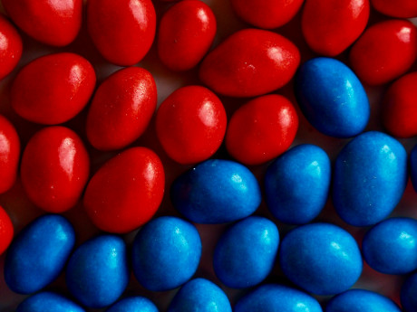

```{r setup, include=FALSE}
knitr::opts_chunk$set(
  echo = TRUE,
  collapse = TRUE,
  comment = "#>"
)
pacman::p_load(
  colorspace,
  cowplot,
  dplyr,
  extraDistr,
  ggplot2,
  hrbrthemes,
  knitr,
  magrittr,
  png,
  tibble,
  tidyr,
  vibass,
  waffle
)

```


# Introduction

We know that probabilities and proportions take values between 0 and 1. But in some studies the relevant information about them is presented on a different scale. Although different scales can be found in the statistical literature, we will only use the two most popular ones, which are the _odds_ and the _log-odds_, also known as the _logit_ function. 

- Any probability  $\theta$ can be expressed in terms of odds as $$\mbox{odds} (\theta)=\frac{\theta}{ 1-\theta}$$

- Any probability $\theta$ can be expressed in the log-odds scale as $$\mbox{log-odds} (\theta)= \mbox{log}\,\frac{\theta}{ 1-\theta}$$

The odds of an event represent the ratio of the  probability  $\theta$ that the event will occur to the probability $1-\theta$ that the event will not occur. The odds scale extends the probability to the set of positive reals. The logit transformation are odds in logarithmic scale and extends the probability to all reals, positive and negative.   

```{r fig-transformations, fig.cap = cap, echo = FALSE, fig.width=3, fig.height=3}
cap <- "Probability-scale transformations."
vibass:::fig_transformations
```

#  Return to study of  the proportion of red M$\&$M's

We return to the M&M problem. We recall that the  posterior  distribution for the proportion $\theta$ of red candies in the population  that we   obtained in the first practice was  

$$\pi(\theta \mid \mathcal{D})= \mbox{Be}(\alpha=4.5, \beta= 16.5) $$

whose graphic was \vspace*{0.2cm} 

```{r, fig.align='center', out.width="60%"}
theta <- seq(0, 1, 0.01)
posterior <- dbeta(theta, 4.5, 16.5)
plot(theta, posterior, type="l", lwd=4, col="red", xlim=c(0, 1), ylim=c(0, 5),
      xlab=expression(paste("proportion of red candies ", theta ))) 
```

Let's obtain the posterior distribution of $\theta$ on the odds scale, 
$\pi(\mbox{odds}(\theta) \mid \mathcal D)$ and we will leave  the simulation of 
$\pi(\mbox{log-odds}(\theta) \mid \mathcal D)$ as individual work at the end of the practice.

## Computation of $\pi(\mbox{odds}(\theta) \mid \mathcal D)$

We could try to obtain the distribution a posteriori $\pi(\mbox{odds}(\theta) \mid \mathcal D)$ from using probabilistic tools but we will not choose that path. We will simulate it from a random sample of $\pi( \theta  \mid \mathcal D)$ as follows: \vspace*{0.2cm}

- If $\{\theta^{(1)}, \theta^{(2)}, \ldots, \theta^{(M)}\}$ is a random sample from $\pi(\theta \mid \mathcal D)$ then $\{\mbox{odds}(\theta^{(1)}), \mbox{odds}(\theta^{(2)}), \ldots, \mbox{odds}(\theta^{(M)})\}$ is a random sample from $\pi(\mbox{odds}(\theta) \mid \mathcal D)$.  \vspace*{0.2cm}

It is clear that the larger the simulated sample the better   approximation to the target distribution. We will work with a sample size of $M=10\,000$ but everyone is free to use the size they want, or even to try different sizes to see how the simulated sample  gets closer and closer to the real one when the size of the sample increases. Although it is not necessary, and only as an illustration, we  also simulate 
$\pi(\theta \mid \mathcal{D})= \mbox{Be}(\alpha=4.5, \beta= 16.5)$, and   we will superimpose the posterior  on the simulated sample.
\vspace*{0.2cm}


```{r, fig.align='center', out.width="70%"}
theta.r <- rbeta(10000, 4.5, 16.5)
hist(theta.r, breaks = 70, freq=FALSE, col="gray98", main="", xlim=c(0,1), ylim=c(0,5), 
     xlab=expression(paste("proportion of red candies ", theta )), ylab="posterior")
theta<-seq(0,1,0.001)
posterior<-dbeta(theta, 4.5, 16.5)
lines(theta, posterior, col="red", type="l", lwd=2.7)
```

We then approximate the posterior distribution for the odds of $\theta$ \vspace*{0.2cm}


```{r, fig.align='center', out.width="70%"}
oddstheta.r <- theta.r/(1-theta.r)
hist(oddstheta.r,
     breaks = 100, freq=FALSE, col="gray98", main="", xlim=c(0,1.5), ylim=c(0,4), 
     xlab=expression(paste("odds of the proportion of red candies ", theta )),
     ylab="posterior"
)
```
 
We can also approximate any characteristic of the  posteriori distribution that we are interested in, such as the posterior mean, variance, standard deviation, 5th, 50 th and 95th percentile, 95$\%$ credible interval and any probability   posterior probability, e.g. $P(\mbox{odds}(\theta)>1 \mid \mathcal D)$ by means of the corresponding  characteristics of the simulated sample.   

```{r summary-table-odds-theta}
summary_table(
  mean = mean(oddstheta.r),
  var = var(oddstheta.r),
  quant = quantile(oddstheta.r, probs = c(0.05, 0.5, 0.95)),
  ic95 = quantile(oddstheta.r, probs = c(.025,  0.975)),
  prop1 = mean(oddstheta.r > 1),
  label = "$\\text{odds}(\\theta)$"
)
```

#  Comparing the proportion of red and blue M$\&$M's

Suppose now that we want to compare the proportion of red and blue candies in the population. 
\vspace*{0.4cm} 

<center>


 
</center>

\vspace*{0.4cm}

In the previous practice we have learned about the proportion of red M&Ms but so far we do not know anything about the blue ones. Let's imagine that we repeat the previous practice again but with the objective of learning about the proportion of blue candies we will call $\theta_b$ and that the resulting Bayesian learning process has been:

- Prior distribution: $\pi(\theta_b)=\mbox{Be}(0.5, 0.5)$
- Data $\mathcal D_b$: $n=50$ M&M's observed, $r=14$ blue candies
- Posterior distribution: $\pi(\theta_b \mid \mathcal D_b)=\mbox{Be}(14.5, 36.5)$


 
We denote $\theta_r$ from now on as the proportion of red candies. We plot the posterior distribution on the proportion on red candies and the one for the blue candies on the same graph. \vspace*{0.2cm}


```{r, fig.align='center', out.width="70%"}
theta <- seq(0, 1, 0.01)
posterior.blue <- dbeta(theta, 14.5, 36.5)
posterior.red <- dbeta(theta, 4.5, 16.5)
plot(theta, posterior.blue, type="l", lwd=4, col="dodgerblue1", xlim=c(0, 1), ylim=c(0, 7),
      xlab=expression(paste("proportion of blue and red candies ",   )), ylab="posterior") 
lines(theta, posterior.red, col="red", type="l", lwd=2.7)
```

\vspace{0.3cm}

Visually, we observe that the proportion of blue candies is slightly higher than that of the red ones. Also, since the sample to obtain their distribution is larger than the one we considered for the red ones, their variability is slightly lower. 

\vspace*{0.3cm}


We have separate information on each proportion through its posterior distribution. We would like to obtain a distribution that provides joint information from both quantities.  Since the inferential processes, prior distribution, experiment, data and likelihood function, for both proportions are independent of each other we will have that the joint posterior distribution of both proportions    are independent a posteriori.

$$\pi(\theta_r, \theta_b \mid \mathcal D_r, \mathcal D_b)= \mbox{Be}(\theta_r \mid 4.5, 16.5) \, \mbox{Be}(\theta_b \mid 14.5, 36.5),$$

where $\mathcal D_r$ is from now on the data of the inferential process of the red M&M's. 

There are many proposal for comparing both proportions. The two most popular are possibly the risk difference, $\theta_b - \theta_r$ or  $\theta_r - \theta_b$, and the relative risk,  $\theta_b /\theta_r$ 
or  $\theta_r / \theta_b$. We now focus on $\theta_b - \theta_r$. Since $\theta_b - \theta_r$   is a function of $\theta_b$ and $\theta_r$, it would make sense to consider the posterior distribution of its difference $\pi(\theta_b - \theta_r \mid \mathcal D_b, \mathcal D_r)$. Such a distribution should not be analytical but we can simulate it in the following way:  \vspace*{0.2cm}
 
1. Simulate a random sample $\{\theta_r^{(1)}, \theta_r^{(2)}, \ldots, \theta_r^{(M)} \}$  from $\pi(\theta_r \mid \mathcal D_r)=\mbox{Be}(\theta_r \mid 4.5, 16.5)$
2. Simulate a random sample $\{\theta_b^{(1)}, \theta_b^{(2)}, \ldots, \theta_b^{(M)} \}$  from $\pi(\theta_b \mid \mathcal D_b)=\mbox{Be}(\theta_b \mid 14.5, 36.5)$
3.  A random sample from $\pi(\theta_b - \theta_r \mid \mathcal D_b, \mathcal D_r)$ is $\{\theta_b^{(1)}-\theta_r^{(1)}, \theta_b^{(2)}-\theta_r^{(2)}, \ldots, \theta_b^{(M)}-\theta_r^{(M)} \}$.
 
 \vspace*{0.2cm} 
We are going to graphically represent this distribution and to calculate approximately its main characteristics. \vspace*{0.2cm}

```{r, fig.align='center', out.width="70%"}
theta.r <- rbeta(10000, 4.5, 16.5)
theta.b <- rbeta(10000, 14.5, 36.5)
theta.dif <- theta.b- theta.r
hist(theta.dif, breaks = 70, freq=FALSE, col="gray98", main="", xlim=c(-0.5, +0.5), ylim=c(0,4), 
     xlab="proportion  blue - proportion red", ylab="posterior")
```


```{r summary-table-theta-diff}
summary_table(
  mean = mean(theta.dif),
  var = var(theta.dif),
  quant = quantile(theta.dif, probs = c(0.05, 0.5, 0.95)),
  ic95 = quantile(theta.dif, probs = c(.025,  0.975)),
  prop0 = mean(theta.dif > 0),
  label = "$\\theta_b - \\theta_r$"
)
```


# Individual work 
We will now work individually on the simulation procedure of the   posterior  distribution of a function of the quantity of interest and also the comparison of two groups through the relative risk. \vspace*{0.2cm}

\textcolor{red}{EXERCISE}  

 

1. Compute the posterior distribution of the proportion of red M&M's in the log-odds scale as well as its main characteristics 

2. Compare the proportion of red and blue M&M's through the relative risk $\theta_b/\theta_r$. 

3. It would be good if we could make a little reflection on the frequentist procedure to compare two proportions and on the differences with the Bayesian procedure. 

