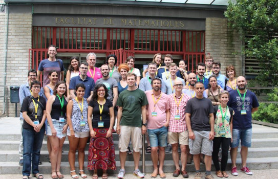

```{r setup, include=FALSE}
knitr::opts_chunk$set(
  echo = TRUE,
  collapse = TRUE,
  comment = "#>"
)
```


# How tall  the VIBASS' students are?

One of the most commonly used examples of normal data are heights and weights. We want to continue this tradition. We will dedicate this practice to work with the heights of the VIBASS students of the past editions. We start first with the height of the women. 

```{r fig.cap = cap, echo = FALSE, fig.align='center'}
cap <- "Some VIBASS students."

```


# Bayesian inference for the  mean height of the women VIBASS students. The variance of the sampling normal model is known.


## The data

We have the following height data, in meters, for a random sample of $n=15$ women students from previous editions of VIBASS.  

```{r, eval=TRUE}
hwomen<- data.frame(height= c(1.73, 1.65, 1.65, 1.76, 1.65, 1.63, 1.70, 1.58, 1.57, 1.65, 
1.74, 1.68, 1.67, 1.58, 1.66))
```

 
 We can summarize the data and represent them by means of a histogram.   

 ```{r}
hsummary <-summary(hwomen)
hsummary
sd(hwomen$height)
sd(hwomen$height)^2
```

```{r, fig.align='center', out.width="65%"}
hist(hwomen$height,  col="gray89", main=" ", xlab="Height in meters", xlim=c(1.50, 1.85), 
     freq = NULL) 
```

The histogram obtained does not remind us much of the normal distribution. But we know that when we work with small amounts of data, even if they are normal, we cannot expect their histogram to look like a symmetrical bell. In fact, if we were to generate small normal data samples, few of them would resemble the Gaussian ideal. 

## The sampling model is approximately normal

Let $Y$ the random variable that describes the  height of the women in VIBASS. We assume that given  $\mu$,  the mean of the height of the VIBASS women, the distribution of $Y$ is normal with mean $\mu$ and standard deviation $\sigma= 0.1$ 

$$Y \mid \mu \sim \mbox{N}(\mu, \sigma=0.1),$$
whose conditional density function, expectation and variance  is: 

- $f(y \mid \mu )= \frac{1}{0.1 \,\sqrt{2 \pi}}\, \mbox{e}^{\big\{ \frac{-1}{2 \,\cdot \, 0.01^2}\,(y-\mu)^2\big\}}$    
- E$(Y\mid \mu)= \mu$, 
- Var$(Y\mid \mu)=\sigma^2=0.01.$

 
 

## A prior distribution for $\mu$

Recall that the normal distribution is conjugate with respect to the Normal probability model  with $\sigma$ known. If we elicit
a   normal prior distribution N$(\mu_0, \sigma_0)$ for   $\mu$, its density is 

$$\pi(\mu)=\frac{1}{\sigma_0 \,\sqrt{2 \pi}}\, \mbox{e}^{\, \frac{-1}{2\sigma_{0}^2}\,(\mu-\mu_0)^2 }$$

with prior mean and  and variance

- E$(\mu)= \mu_0$, 
- Var$(\mu)= \sigma_0.$

We are going to work with a prior distribution based on the information   from two of the VIBASS lecturers. This prior distribution is   

$$\pi(\mu) = \mbox{N}(\mu_0=1.70, \sigma_0=0.07)$$
On the basis of this distribution these two teachers think that the mean of the  height of women VIBASS students is centered on 1.70 meters with a standard deviation of 0.07 meters. According to it, we can compute the following percentile and probabilities \vspace*{0.2cm}

```{r}
qnorm(c(0.005, 0.995), 1.70, 0.07)
pnorm(c(1.50, 1.60, 1.70, 1.80, 1.90), 1.70, 0.07)
 
```

Consequently,  a 99$\%$ credible interval for $\mu$ is $(1,52, \,1.88)$ which means that  the probability that a VIBASS student  is neither taller than 1.88 meters nor shorter than 1.52 is 0.99. The probability that she is shorter than 1.50 is 0.0021, the probability that her height is between 1.60 and 1.80 is 0.9234-0.0766= 0.8468 or the probability that is taller than 1.80 is 1-0.9234=0.0766. Next we show the graphic of the density  of this prior distribution. \vspace*{0.2cm}


 

 ```{r, fig.align='center', out.width="60%"}
simu<-seq(1.40,2.0,0.01)
prior <- dnorm(simu, 1.7, 0.07)
plot(simu, prior, type="l", lwd=4, col="dodgerblue",  xlim=c(1.40,2.0), 
  ylim=c(0,7), xlab=expression(paste(mu))) 
```

## The likelihood function of  $\mu$

The likelihood is a function of $\mu$ for the data $\mathcal D=\{y_1, y_2,\ldots, y_{15} \}$.  It is defined as follows

\begin{align*}
L(\mu \mid \mathcal D)=& f(y_1, y_2, \ldots,  y_{15} \mid \mu) =
    \prod_{i=1}^{15}\, f(y_i \mid \mu) =
 \prod_{i=1}^{15}\, \frac{1}{0.1\,\sqrt{2 \pi}}\, \mbox{exp}\Big\{\, \frac{-1}{2 \cdot 0.1^2}\,(y_i-\mu)^2\Big\} \\
= &  \, \frac{1}{(0.1\,\cdot\sqrt{2 \pi})^{15}}\,\,\mbox{exp}\Big\{\, \frac{-1}{2 \cdot 0.1^2}\,\sum_{i=1}^{15}\,(y_i-\mu)^2\Big \} \\
  =  &\,\frac{1}{(0.1\,\cdot\sqrt{2 \pi})^{15}}\,\,\mbox{exp}\Big\{\, \frac{-1}{2 \cdot 0.1^2}\,(\sum_{i=1}^{15} y_i^{2} - 2 \cdot 15 \, \bar{y} \, \mu + 15 \mu^2)\Big \}
\end{align*}


where $f(y_1, y_2, \ldots, y_{15})$ is the joint density of the $Y_i$'s given $\mu$  evaluated in $\mathcal D$. Since $Y_i$'s are independent given $mu$ the joint density is the product of the marginal densities.   In our case, the likelihood function of $\mu$ is

 
 ```{r, fig.align='center', out.width="60%"}
y <- hwomen$height
n <- length(y)
y_bar <- mean(y)
sigma <- 0.1
Lnorm <- function(y, mu, sigma){
  prod(dnorm(y, mean= mu, sd= sigma))
}
aux <- seq(1.40, 2.00, by =0.001)
aux2 <- sapply(aux,FUN = Lnorm,y=y,sigma=sigma)
C <- 1/sum(0.001*aux2)
plot(aux, C*aux2, type = "l", main = " ",  lwd=4, col="darkorange", 
       xlab=expression(paste(mu)), ylab="likelihood") 
```


## The posterior distribution of $\mu$

The posterior distribution of $\mu$    is a normal distribution with parameters

 \begin{align*}
 \pi(\mu \mid & \mathcal{D})= \mbox{N}(\mu_n, \sigma_n), \, \mbox{ where}\\
  & \sigma^2_n=\frac{\sigma_0^2\,\sigma^2}{\sigma^2 + n \,\sigma_0^2}= \frac{0.07^2 \cdot 0.1^2}{0.1^2 + 15 \cdot 0.07^2}= 0.000587, \,\,\, \sigma_n=0.0242\\
 &  \mu_n= \sigma_n^2 \,\Big (\frac{\mu_0}{\sigma_0^2}\,+ \, \frac{n \bar{y}}{\sigma^2}\Big)= 0.000587 \Big(\frac{1.70}{0.07^2} +\frac{15 \cdot 1.66}{0.1^2}\Big)= 1.6648 
 \end{align*}
  
 Next, we plot on the same graph the   prior (in blue) and the posterior distribution (in green) of $\mu$  
 \begin{align*}
 \pi(\mu &)=\mbox{N}(\mu_0=1.70, \sigma_0=0.07)\\
  \pi(\mu &\mid \mathcal D)=\mbox{N}(\mu_n=1.6648, \sigma_n=0.0242)
 \end{align*}
 
  ```{r, fig.align='center', out.width="60%"}
simu<-seq(1.40,2.0,0.001)
prior <- dnorm(simu, 1.7, 0.07)
plot(simu, prior, type="l", lwd=4, col="dodgerblue",  xlim=c(1.40,2.0), 
  ylim=c(0,17), xlab=expression(paste(mu)))
posterior <- dnorm(simu, 1.6648, 0.0242)
  lines(simu, posterior, col="darkgreen", type="l", lwd=4)
```

The visual difference between the two distributions is very clear: The posterior distribution has a very low variability compared to the prior ($\sigma_n=0.0242$ meters versus $\sigma_0=0.07$) and is slightly more shifted to the left because the posterior mean is slightly lower than the prior mean ($\mu_n=1.6642$ versus $\mu_0=1.70$). 

On the basis of the posterior distribution    the  two teachers think that the mean of the  height of women VIBASS students is centered on 1.6642 meters with a standard deviation of 0.0242 meters. According to it, we can compute the following percentile and probabilities \vspace*{0.2cm}

```{r}
qnorm(c(0.005, 0.995), 1.6642, 0.0242)
pnorm(c(1.50, 1.60, 1.70, 1.80, 1.90), 1.6642, 0.0242)
```

Consequently,  a 99$\%$ credible interval for $\mu$ is $(1,60, \,1.73)$ which means that  the probability that a VIBASS student  is neither taller than 1.73 meters nor shorter than 1.60 is 0.99. The probability that she is shorter than 1.50 is 0.0000, the probability that her height is between 1.60 and 1.80 is 1.0000-0.0040=0.9960 or the probability that is taller than 1.80 is 0.0000.  \vspace*{0.2cm}

## The posterior predictive distribution for the height of a new VIBASS student

We are interested in predicting the height of   Anin\`e, a new woman VIBASS  student who has not participed in the sample of the inferential process.  In this case, the posterior predictive distribution for the Anin\`e's height  $Y_{16}$  is a normal distribution  \vspace*{0.2cm}

$$\mbox{N}(\mu_n=1.6642, \sqrt(\sigma_n^2+\sigma^2)=\sqrt(0.000587+0.01)=0.1029)$$
It is important to note that the mean of this predictive distribution  coincides with the mean of the   posterior distribution of $\mu$. However, the enormous variability of the predictive distribution, which depends on the variability of the sampling model and the variability of the a posteriori distribution, is very striking. The following graph shows  the posterior distribution (in green) of $\mu$  and the posterior predictive distribution (in purple) for the Anin\`e's height and makes the previous comments very well visible.   \vspace*{0.2cm}

```{r, fig.align='center', out.width="60%"}
simu <- seq(1.40, 2.0, 0.001)
posterior <- dnorm(simu, 1.6648, 0.0242)
plot(simu, posterior, type="l", lwd=4, col="darkgreen", xlim=c(1.40,2.0), 
  ylim=c(0,17))
predictive <- dnorm(simu, 1.6642, 0.1029)
lines(simu, predictive, col="purple", type="l", lwd=4)
```
 
We can calculate prediction intervals for the height of Anin\`e. A prediction interval at 95 $%$ would be
 \vspace*{0.2cm}

```{r}
qnorm(c(0.025, 0.975), 1.6642, 0.1029)
```
This indicates that the probability that Anin\`e's height   is between 1.46 and 1.87 meters is 0.95. 


# Bayesian inference for the  mean height of the women VIBASS students. The variance of the sampling normal model is unknown.


If we follow the same scheme as in the previous case where the variance was known, we would have a first section dedicated to the data which would be the same. The sampling model is also approximately normal but now we will work with a normal with unknown mean and variance. 

 

## The sampling model is approximately normal

Let $Y$ the random variable that describes the  height of the women in VIBASS. We assume that given  $\mu$,  the mean of the height of the VIBASS women, the distribution of $Y$ is normal with unknown mean $\mu$ and unknown standard deviation $\sigma$ 

$$Y \mid \mu \sim \mbox{N}(\mu, \sigma),$$
whose conditional density function, expectation and variance  is: 

- $f(y \mid \mu )= \frac{1}{0.1 \,\sqrt{2 \pi}}\, \mbox{e}^{\big\{ \frac{-1}{2 \,\cdot \, 0.01^2}\,(y-\mu)^2\big\}}$    
- E$(Y\mid \mu)= \mu$, 
- Var$(Y\mid \mu)=\sigma^2.$

 

## A prior distribution for $(\mu, \sigma)$

Our basic quantity of interest is bidimensional $(\mu, \sigma^2)$.  We work in a non-informative prior scenario and use the improper Jefreys's prior distribution 

$$\pi(\mu, \sigma^2) \propto \mbox{constant}$$


## The likelihood function of  $(\mu,  \sigma^2)$

The likelihood is a function of $(\mu,  \sigma^2)$ for the data $\mathcal D=\{y_1, y_2,\ldots, y_{15} \}$.  It is defined as follows

\begin{align*}
L(\mu, \sigma^2 \mid \mathcal D)=& f(y_1, y_2, \ldots,  y_{15} \mid \mu, \sigma^2) =
    \prod_{i=1}^{15}\, f(y_i \mid \mu, \sigma^2) =
 \prod_{i=1}^{15}\, \frac{1}{\sigma \,\sqrt{2 \pi}}\, \mbox{exp}\Big\{\, \frac{-1}{2\sigma^2}\,(y_i-\mu)^2\Big\} \\
= &  \, \frac{1}{(\sigma\,\sqrt{2 \pi})^{15}}\,\,\mbox{exp}\Big\{\, \frac{-1}{2\sigma^2}\,\sum_{i=1}^{15}\,(y_i-\mu)^2\Big \} \\
  =  &\,\frac{1}{(\sigma\,\sqrt{2 \pi})^{15}}\,\,\mbox{exp}\Big\{\, \frac{-1}{2  \sigma^2}\,(\sum_{i=1}^{15} y_i^{2} - 2 \cdot 15 \, \bar{y} \, \mu + 15 \mu^2)\Big \},
\end{align*}


where $f(y_1, y_2, \ldots, y_{15})$ is the joint density of the $Y_i$'s given $\mu$  evaluated in $\mathcal D$. Since $Y_i$'s are independent given $\mu$ and $\sigma^2$,  the joint density is the product of the marginal densities.   In our case, the graphic of the likelihood function of $(\mu, \sigma^2)$ will be


```{r, fig.align='center', out.width="95%"}
library(rgl)
library(plot3D)
s<-  function(mu)  {(as.vector( hwomen$height)-mu)^2}
f<-  function  (mu,sigma)  prod((sigma*sqrt(2*pi))^(-1)*exp(-s(mu)/(2*sigma^2))) 

x<- seq(1.60, 1.75, by=0.001)
y<- seq(0.03, 0.10, by=0.001)
Z<- matrix(nrow=length(x), ncol=length(y))

for (i in 1:length(x)) {
for (j in 1:length(y)) {
Z[i,j]<- f(x[i],y[j])
}
}
require(plot3D)
persp3D(x=x, y=y, z=Z, theta=120, phi=10, ticktype="detailed", colkey = FALSE, 
        xlab='mu', ylab='sigma2', zlab='', axes=TRUE)
```

## The posterior distribution of $(\mu,  \sigma^2)$

The posterior distribution of $(\mu, \sigma^2)$ is a bivariant probability distribution  whose joint   posterior  density function can be expressed in terms of the conditional   posterior  distribution of $\mu$ given $\sigma^2$ and the marginal  posterior  distribution of $\sigma^2$ as follows

 \begin{align*}
 \pi(\mu, \sigma^2 \mid & \mathcal{D})=  \pi(\mu \mid \sigma^2, \mathcal{D}) \, \pi(\sigma^2 \mid  \mathcal{D}),
 \end{align*}
  
where

- $\pi(\mu | \sigma^2, \mathcal D)=N(\mu_n=1.66, \sigma^2_n=\sigma^2/15)$
- $\pi(\sigma^2 \mid \mathcal D)$ is such that $\pi((n-1)s^2/\sigma^2 \mid \mathcal D) = \chi^2(n-1)$
- The posterior marginal of $\mu$ is $\pi(\mu \mid \mathcal D)= \mbox{St}(\bar{y}, s^2/n, n-1)$ 


In our case, the more relevant posterior distributions are the marginal ones:

- The posterior marginal $\pi(\sigma^2 \mid \mathcal D)$ of $\sigma^2$ is such that $\pi(0.045598/\sigma^2 \mid \mathcal D) = \chi^2(14)$ (14 $\cdot$ 0.003257= 0.045598)
- The posterior marginal of $\mu$ is $\pi(\mu \mid \mathcal D)= \mbox{St}(1.66, 0.003257/15=0.000217, 14)$ 
 


 We start working with the posterior $\pi(\mu \mid \mathcal D)$. The posterior mean and standard deviation of $\mu$ is    1.66 and  0.014735 meters. A   99$\%$ credible interval for $mu$ is (1.62, 1.70) and the posterior probabilities that the mean of the height of the women VIBASS is less than 1.50, 1.60. 1.70, 1.80, and 1.90 is 0.0000, 0.0006, 0.9916, 1.0000, and 1.0000, respectively. 

 
 ```{r}
0.014735*qt(c(0.005, 0.995), 14)+1.66
pt((c(1.50, 1.60, 1.70, 1.80, 1.90)-1.66)/0.014735, 14)
```  
The graphics of that posterior density is

```{r, fig.align='center', out.width="60%"}
simu <- seq(1.40, 2.0, 0.001)
posterior <- (1/0.014735)*dt((simu-1.66)/0.014735, 14)
plot(simu, posterior, type="l", lwd=4, col="darkgreen", xlim=c(1.40,2.0), 
  ylim=c(0,28), xlab=expression(paste(mu)))
```

 We focus now on the variance of the sampling model. Its posterior distribution is such that   $\pi(0.045598/\sigma^2 \mid \mathcal D) = \chi^2(14)$. This is not the posterior distribution of $\sigma^2$ but a function, $0.045598/\sigma^2$ of it. Consequently, we can approximate the posterior distribution for $\sigma^2$ by simulation as follows:
 
 -  If $$\{a^{(1)}, a^{(2)}, \ldots, a^{(M)}\}$$  is a random sample   from $\pi(0.045598/\sigma^2 \mid \mathcal D) = \chi^2(14)$ then 
   $$\{0.045598/a^{(1)}, 0.045598/a^{(2)}, \ldots, 0.045598/a^{(M)}\}$$  is a random sample from $\pi(\sigma^2 \mid \mathcal D)$. 
 
Next we show the approximate graph and some posterior characteristics of the posterior $\pi(\sigma^2 \mid \mathcal D)$. 

```{r, fig.align='center', out.width="70%"}
y<-seq(0, 40, 0.001)
simuchi<-rchisq(y,14)
simu.sigma<- 0.045598/simuchi 
hist(simu.sigma, breaks = 300, freq=FALSE, col="gray99", main="", xlim=c(0, 0.02),  ylim=c(0,400), ylab="posterior", xlab=expression(paste(sigma2)))
 
summary(simu.sigma)
var(simu.sigma)
sqrt(var(simu.sigma))
quantile(simu.sigma, probs = c(0.005,0.995))
```
We observe that E$(\sigma^\mid \mathcal D)=0.0038$ and a 99$\%$ credible interval for $\sigma^2$ is (0.00147, 0.01118). 


# Time to individual work

We propose below an individual exercise that pursues to consolidate the basic concepts that we have learned in the previous theoretical session and that we have been practising in this session. 


**Exercice** 

We focus now on the height of the VIBASS men participants. 

```{r, eval=TRUE}
data <- data.frame(height = c(1.92, 1.82, 1.69, 1.75, 1.72, 1.71, 1.73, 1.69, 1.70, 1.78, 
1.88, 1.82, 1.86, 1.65))
```
 
1. Construct a Bayesian inferential process for the mean of the height of the VIBASS men participants. Assume a non-informative prior scenario and a sampling model approximately normal with 
1.1 Known variance $\sigma^2=0.1$. 
1.2 Unknown variance. 
2. Compare the mean of the height between men and women. It is possible to compute the posterior probability associated to ? and to $\mu_{men}-\mu_{woman}$? $\mu_{men}/\mu_{woman}$?
