# Introduction

This practical is entirely optional, and presents additional and advanced
material you may wish to try out if you have completed all the work in the
first seven practicals, and have no further questions for us.

We start with an example where we implement specific R code for running the
linear regression example of Practical 5; then we repeat the examples of
Practicals 6 and 7 but using `INLA` rather than `BayesX`. Note we did not
include `INLA` examples in the main material as we did not want to have too many
different packages included, which would detract from the most important
part - learning about Bayesian Statistics!


# Example: Simple Linear Regression

We will illustrate the use of Gibbs Sampling on a simple linear
regression model. Recall that we saw yesterday that we can obtain an
analytical solution for a Bayesian linear regression, but that more
complex models require a simulation approach; in Practical 5, we used the
package `MCMCpack` to fit the model using Gibbs Sampling.

The approach we take here for Gibbs Sampling on a simple linear
regression model is very easily generalised to more complex models,
the key is that whatever your model looks like, you update one
parameter at a time, using the conditional distribution of that
parameter given the current values of all the other parameters.

The simple linear regression model we will analyse here is a reduced
version of the general linear regression model we saw yesterday, and
the same one as in Practical 5:
$$
Y_i = \beta_0+\beta_1x_i+\epsilon_i
$$
for response variable $\mathbf{Y}=\left(Y_1,Y_2,\ldots,Y_n\right)$,
explanatory variable $\mathbf{x}=\left(x_1,x_2,\ldots,x_n\right)$ and
residual vector $\mathbf{\epsilon}=
\left(\epsilon_1,\epsilon_2,\ldots,\epsilon_n\right)$ for a sample of
size $n$, where $\beta_0$ is the regression intercept,
$\beta_1$ is the regression slope, and where the
$\epsilon_i$ are independent with
$\epsilon_i\sim \textrm{N}\left(0,\sigma^2\right)$ $\forall i=1,2,\ldots,n$. For
convenience, we refer to the combined set of $\mathbf{Y}$ and
$\mathbf{x}$ data as $\mathcal{D}$. We also define
$\hat{\mathbf{y}}$ to be the fitted response vector (i.e., 
$\hat{y}_i = \beta_0 + \beta_1 x_i$ from the regression equation) using the
current values of the parameters $\beta_0$, $\beta_1$ and precision $\tau = 1$
(remember that $\tau=\frac{1}{\sigma^2}$) from the Gibbs Sampling simulations.

For Bayesian inference, it is simpler to work with precisions $\tau$
rather than with variances $\sigma^2$. Given priors
$$
\begin{align*}
\pi(\tau) &= \textrm{Ga}\left(\alpha, \beta\right), \\
\pi(\beta_0) &= \textrm{N}\left(\mu_{\beta_0}, \tau_{\beta_0}\right), \quad\textrm{and} \\
\pi(\beta_1) &= \textrm{N}\left(\mu_{\beta_1}, \tau_{\beta_1}\right)
\end{align*}
$$
then by combining with the likelihood we can derive the full conditional distributions for each parameter. For $\tau$, we have
$$
\begin{align*}
\pi\left(\tau|\mathcal{D}, \beta_0, \beta_1\right) &\propto
\pi(\tau)\prod_{i=1}^nL\left(y_i|\hat{y_i}\right), \\
&= \tau^{\alpha-1}e^{-\beta\tau}
\tau^{\frac{n}{2}}\exp\left\{-
\frac{\tau}{2}\sum_{i=1}^n(y_i-\hat{y_i})^2\right\}, \\
&= \tau^{\alpha-1 + \frac{n}{2}}\exp\left\{-\beta\tau-
\frac{\tau}{2}\sum_{i=1}^n(y_i-\hat{y_i})^2\right\},\\
\textrm{so} \quad \tau|\mathcal{D}, \beta_0, \beta_1 &\sim
\textrm{Ga}\left(\alpha+\frac{n}{2},
\beta +\frac{1}{2}\sum_{i=1}^n(y_i-\hat{y_i})^2\right).
\end{align*}
$$
For $\beta_0$ we will need to expand $\hat{y}_i=\beta_0+\beta_1x_i$,
and then we have
$$
\begin{align*}
p(\beta_0|\mathcal{D}, \beta_1, \tau) &\propto
\pi(\beta_0)\prod_{i=1}^nL\left(y_i|\hat{y_i}\right), \\
&= \tau_{\beta_0}^{\frac{1}{2}}\exp\left\{-
\frac{\tau_{\beta_0}}{2}(\beta_0-\mu_{\beta_0})^2\right\}\tau^\frac{n}{2}
\exp\left\{-\frac{\tau}{2}\sum_{i=1}^n(y_i-\hat{y_i})^2\right\}, \\
&\propto \exp\left\{-\frac{\tau_{\beta_0}}{2}(\beta_0-\mu_{\beta_0})^2-
\frac{\tau}{2}\sum_{i=1}^n(y_i-\beta_0-x_i \beta_1)^2\right\}, \\
&= \exp \left\{ -\frac{1}{2}\left(\beta_0^2(\tau_{\beta_0} + n\tau) +
\beta_0\left(-2\tau_{\beta_0}\mu_{\beta_0} - 2\tau\sum_{i=1}^n 
(y_i - x_i\beta_1)\right) \right) + C \right\}, \\
\textrm{so} \quad \beta_0|\mathcal{D}, \beta_1, \tau &\sim
\mathcal{N}\left((\tau_{\beta_0} + n\tau)^{-1}
\left(\tau_{\beta_0}\mu_{\beta_0} + \tau\sum_{i=1}^n (y_i - x_i\beta_1)\right),
\tau_{\beta_0} + n\tau\right).
\end{align*}
$$

In the above, $C$ represents a quantity that is constant with respect to $\beta_0$ and hence can be ignored. Finally, for $\beta_1$ we have
$$
\begin{align*}
p(\beta_1|\mathcal{D}, \beta_0, \tau) &\propto
\pi(\beta_1)\prod_{i=1}^nL\left(y_i|\hat{y_i}\right), \\
&= \tau_{\beta_1}^{\frac{1}{2}}\exp\left\{-
\frac{\tau_{\beta_1}}{2}(\beta_1-\mu_{\beta_1})^2\right\}\tau^\frac{n}{2}
\exp\left\{-\frac{\tau}{2}\sum_{i=1}^n(y_i-\hat{y_i})^2\right\}, \\
&\propto \exp\left\{-\frac{\tau_{\beta_1}}{2}(\beta_1-\mu_{\beta_1})^2-
\frac{\tau}{2}\sum_{i=1}^n(y_i-\beta_0-x_i \beta_1)^2\right\}, \\
&= \exp \left\{ -\frac{1}{2}\left(\beta_1^2\left(\tau_{\beta_1} + 
\tau\sum_{i=1}^n x_i^2\right) +
\beta_1\left(-2\tau_{\beta_1}\mu_{\beta_1} - 2\tau\sum_{i=1}^n 
(y_i - \beta_0)x_i\right) \right) + C \right\}, \\
\textrm{so} \quad \beta_1|\mathcal{D}, \beta_0, \tau
&\sim \textrm{N}\left((\tau_{\beta_1} + \tau\sum_{i=1}^n x_i^2)^{-1}
\left(\tau_{\beta_1}\mu_{\beta_1} + \tau\sum_{i=1}^n (y_i - \beta_0)x_i\right),
\tau_{\beta_1} + \tau\sum_{i=1}^n x_i^2\right).
\end{align*}
$$
This gives us an easy way to run Gibbs Sampling for linear regression; we have
standard distributions as full conditionals and there are standard
functions in R to obtain the simulations.

We shall do this now for an
example in ecology, looking at the relationship between water pollution and
mayfly size - the data come from the book
*Statistics for Ecologists Using R and Excel 2nd edition* by Mark Gardener
(ISBN 9781784271398), see
[the publisher's webpage](https://pelagicpublishing.com/products/statistics-for-ecologists-using-r-and-excel-gardener-2nd-edition).

The data are as follows:

- `length` - the length of a mayfly in mm;

- `BOD` - biological oxygen demand in mg of oxygen per litre, effectively a
measure of organic pollution (since more organic pollution requires more oxygen
to break it down).

The data can be read into R:

``` r
# Read in data
BOD <- c(200,180,135,120,110,120,95,168,180,195,158,145,140,145,165,187,
         190,157,90,235,200,55,87,97,95)
mayfly.length <- c(20,21,22,23,21,20,19,16,15,14,21,21,21,20,19,18,17,19,21,13,
            16,25,24,23,22)
# Create data frame for the Gibbs Sampling, needs x and y
Data <- data.frame(x=BOD,y=mayfly.length)
```

We provide here some simple functions for running the analysis by Gibbs
Sampling, using the full conditionals derived above. The functions assume
you have a data frame with two columns, the response `y` and the covariate
`x`.


``` r
# Function to update tau, the precision
sample_tau <- function(data, beta0, beta1, alphatau, betatau) {
  rgamma(1,
    shape = alphatau+ nrow(data) / 2,
    rate = betatau+ 0.5 * sum((data$y - (beta0 + data$x*beta1))^2)
  )
}

# Function to update beta0, the regression intercept
sample_beta0 <- function(data, beta1, tau, mu0, tau0) {
  prec <- tau0 + tau * nrow(data)
  mean <- (tau0*mu0 + tau * sum(data$y - data$x*beta1)) / prec
  rnorm(1, mean = mean, sd = 1 / sqrt(prec))
}

# Function to update beta1, the regression slope
sample_beta1 <- function(data, beta0, tau, mu1, tau1) {
  prec <- tau1 + tau * sum(data$x * data$x)
  mean <- (tau1*mu1 + tau * sum((data$y - beta0) * data$x)) / prec
  rnorm(1, mean = mean, sd = 1 / sqrt(prec))
}

# Function to run the Gibbs Sampling, where you specify the number of
# simulations `m`, the starting values for each of the three regression
# parameters (`tau_start` etc), and the parameters for the prior
# distributions of tau, beta0 and beta1
gibbs_sample <- function(data,
                         tau_start,
                         beta0_start,
                         beta1_start,
                         m,
                         alpha_tau,
                         beta_tau,
                         mu_beta0,
                         tau_beta0,
                         mu_beta1,
                         tau_beta1) {
  tau <- numeric(m)
  beta0 <- numeric(m)
  beta1 <- numeric(m)
  tau[1] <- tau_start
  beta0[1] <- beta0_start
  beta1[1] <- beta1_start
  
  for (i in 2:m) {
    tau[i] <-
      sample_tau(data, beta0[i-1], beta1[i-1], alpha_tau, beta_tau)
    beta0[i] <-
      sample_beta0(data, beta1[i-1], tau[i], mu_beta0, tau_beta0)
    beta1[i] <-
	sample_beta1(data, beta0[i], tau[i], mu_beta1, tau_beta1)
  }
  
  Iteration <- 1:m
  data.frame(Iteration,beta0,beta1,tau)
}
```

## Exercises

We will use Gibbs Sampling to fit a Bayesian Linear Regression model to the
mayfly data, with the above code. We will use the following prior distributions
for the regression parameters:
$$
\begin{align*}
\pi(\tau) &= \textrm{Ga}\left(1, 1\right), \\
\pi(\beta_0) &= \textrm{N}\left(0, 0.0001\right), \quad\textrm{and} \\
\pi(\beta_1) &= \textrm{N}\left(0, 0.0001\right).
\end{align*}
$$
We will set the initial values of all parameters to 1, i.e. $\beta_0^{(0)}=\beta_1^{(0)}=\tau^{(0)}=1$.

### Data exploration

- Investigate the data to see whether a linear regression model would be
sensible. [You may not need to do this step if you recall the outputs from
Practical 5.]

    <details><summary>Solution</summary>

    
    ``` r
    # Scatterplot
    plot(BOD,mayfly.length)
    ```
    
    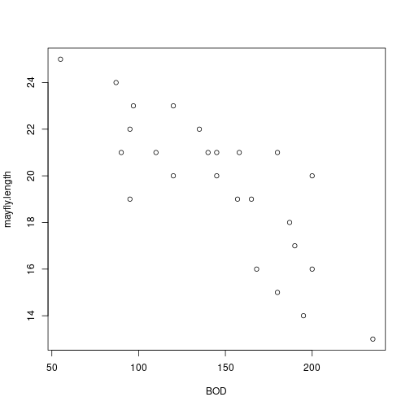
    
    ``` r
    # Correlation with hypothesis test
    cor.test(BOD,mayfly.length)
    ```
    
    ```
    ## 
    ## 	Pearson's product-moment correlation
    ## 
    ## data:  BOD and mayfly.length
    ## t = -6.52, df = 23, p-value = 1.185e-06
    ## alternative hypothesis: true correlation is not equal to 0
    ## 95 percent confidence interval:
    ##  -0.9107816 -0.6020516
    ## sample estimates:
    ##        cor 
    ## -0.8055507
    ```

    </details>
    
- Run a frequentist simple linear regression using the `lm` function in R; this
will be useful for comparison with our Bayesian analysis.

    <details><summary>Solution</summary>

    
    ``` r
    # Linear Regression using lm()
    linreg <- lm(mayfly.length ~ BOD, data = Data)
    summary(linreg)
    ```
    
    ```
    ## 
    ## Call:
    ## lm(formula = mayfly.length ~ BOD, data = Data)
    ## 
    ## Residuals:
    ##    Min     1Q Median     3Q    Max 
    ## -3.453 -1.073  0.307  1.105  3.343 
    ## 
    ## Coefficients:
    ##              Estimate Std. Error t value Pr(>|t|)    
    ## (Intercept) 27.697314   1.290822   21.46  < 2e-16 ***
    ## BOD         -0.055202   0.008467   -6.52 1.18e-06 ***
    ## ---
    ## Signif. codes:  0 '***' 0.001 '**' 0.01 '*' 0.05 '.' 0.1 ' ' 1
    ## 
    ## Residual standard error: 1.865 on 23 degrees of freedom
    ## Multiple R-squared:  0.6489,	Adjusted R-squared:  0.6336 
    ## F-statistic: 42.51 on 1 and 23 DF,  p-value: 1.185e-06
    ```

    </details>

### Running the Gibbs Sampler

- Use the code above to fit a Bayesian simple linear regression using `length`
as the response variable. Ensure you have a burn-in period so that the initial
simulations are discarded. Use the output from `gibbs_sample` to estimate the
regression parameters (with uncertainty measures). Also plot the estimates of
the posterior distributions.

    <details><summary>Solution</summary>

    
    ``` r
    # Bayesian Linear Regression using a Gibbs Sampler
    
    # Set the number of iterations of the Gibbs Sampler - including how many to
    # discard as the burn-in
    m.burnin <- 500
    m.keep <- 1000
    m <- m.burnin + m.keep
    
    # Obtain the samples
    results1 <- gibbs_sample(Data,1,1,1,m,1,1,0,0.0001,0,0.0001)
    # Remove the burn-in
    results1 <- results1[-(1:m.burnin),]
    # Add variance and standard deviation columns
    results1$Variance <- 1/results1$tau
    results1$StdDev <- sqrt(results1$Variance)
    # Estimates are the column means
    apply(results1[,-1],2,mean)
    ```
    
    ```
    ##       beta0       beta1         tau    Variance      StdDev 
    ## 27.65318069 -0.05486106  0.30030561  3.64651228  1.88708959
    ```
    
    ``` r
    # Also look at uncertainty
    apply(results1[,-1],2,sd)
    ```
    
    ```
    ##       beta0       beta1         tau    Variance      StdDev 
    ## 1.333977050 0.008754095 0.088994547 1.180979250 0.292387827
    ```
    
    ``` r
    apply(results1[,-1],2,quantile,probs=c(0.025,0.975))
    ```
    
    ```
    ##          beta0       beta1       tau Variance   StdDev
    ## 2.5%  24.94863 -0.07188798 0.1532262 1.997486 1.413324
    ## 97.5% 30.31030 -0.03701739 0.5006294 6.526298 2.554662
    ```
    
    ``` r
    # Kernel density plots for beta0, beta1 and the residual stanard deviation
    plot(density(results1$beta0, bw = 0.5),
         main = "Posterior density for beta0")
    ```
    
    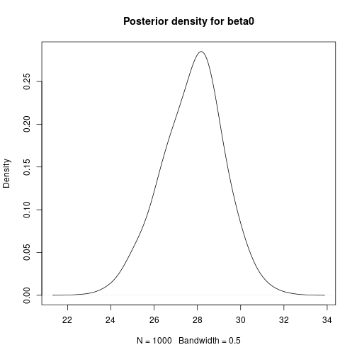
    
    ``` r
    plot(density(results1$beta1, bw = 0.25),
         main = "Posterior density for beta1")
    ```
    
    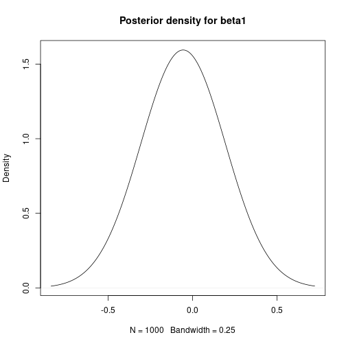
    
    ``` r
    plot(density(results1$StdDev, bw = 0.075),
         main = "Posterior density for StdDev")
    ```
    
    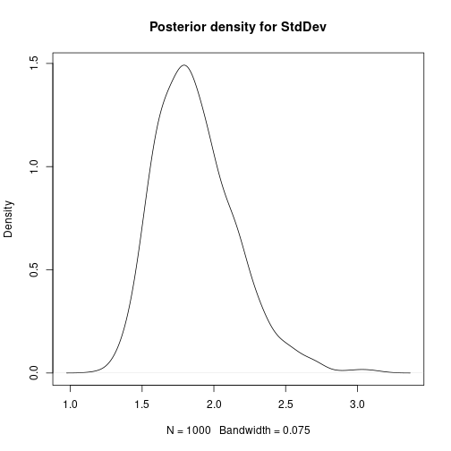

    </details>

- Use the function `ts.plot()` to view the autocorrelation in the Gibbs
sampling simulation chain. Is there any visual evidence of autocorrelation, or
do the samples look independent?

    <details><summary>Solution</summary>
    
    
    ``` r
    # Plot sampled series
    ts.plot(results1$beta0,ylab="beta0",xlab="Iteration")
    ```
    
    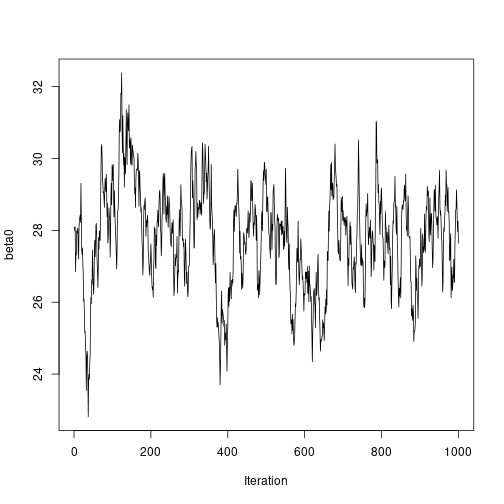
    
    ``` r
    ts.plot(results1$beta1,ylab="beta1",xlab="Iteration")
    ```
    
    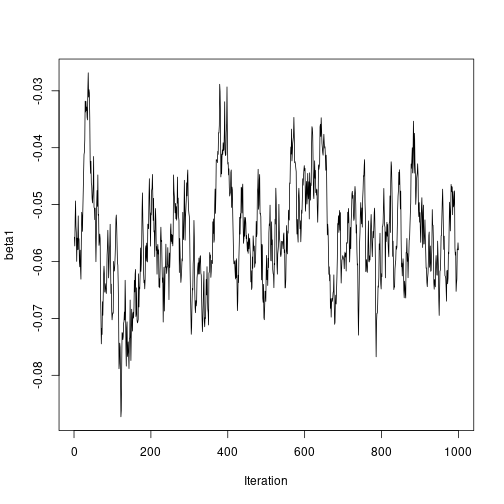
    
    ``` r
    ts.plot(results1$StdDev,ylab="sigma",xlab="Iteration")
    ```
    
    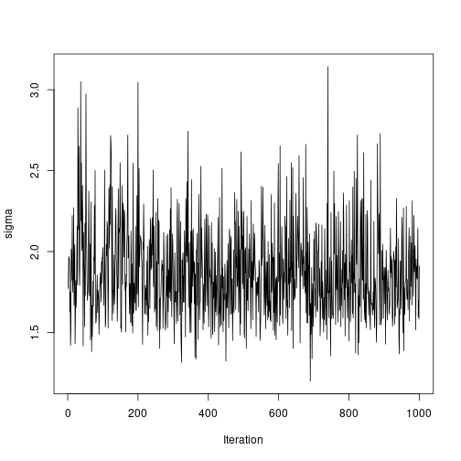

    </details>

- How do the results compare with the frequentist output?

### Reducing the autocorrelation by mean-centering the covariate

- One method for reducing the autocorrelation in the sampling chains for
regression parameters is to mean centre the covariate(s); this works because
it reduces any dependence between the regression intercept and slope(s). Do
this for the current example, noting that you will need to make a correction
on the estimate of the regression intercept afterwards.

    <details><summary>Solution</summary>

    
    ``` r
    # Mean-centre the x covariate
    DataC <- Data
    meanx <- mean(DataC$x)
    DataC$x <- DataC$x - meanx
    
    # Bayesian Linear Regression using a Gibbs Sampler
    
    # Set the number of iterations of the Gibbs Sampler - including how many to
    # discard as the burn-in
    m.burnin <- 500
    m.keep <- 1000
    m <- m.burnin + m.keep
    
    # Obtain the samples
    results2 <- gibbs_sample(DataC, 1, 1, 1, m, 1, 1, 0, 0.0001, 0, 0.0001)
    # Remove the burn-in
    results2 <- results2[-(1:m.burnin), ]
    
    # Correct the effect of the mean-centering on the intercept
    results2$beta0 <- results2$beta0 - meanx * results2$beta1
    
    # Add variance and standard deviation columns
    results2$Variance <- 1 / results2$tau
    results2$StdDev <- sqrt(results2$Variance)
    # Estimates are the column means
    apply(results2[, -1], 2, mean)
    ```
    
    ```
    ##      beta0      beta1        tau   Variance     StdDev 
    ## 27.7619863 -0.0554732  0.3055647  3.5419578  1.8627159
    ```
    
    ``` r
    # Also look at uncertainty
    apply(results2[, -1], 2, sd)
    ```
    
    ```
    ##       beta0       beta1         tau    Variance      StdDev 
    ## 1.339327429 0.008712278 0.084838193 1.070089030 0.268923052
    ```
    
    ``` r
    apply(results2[, -1], 2, quantile, probs = c(0.025, 0.975))
    ```
    
    ```
    ##          beta0       beta1       tau Variance   StdDev
    ## 2.5%  25.16694 -0.07283719 0.1603452 2.002122 1.414964
    ## 97.5% 30.36258 -0.03852308 0.4994701 6.236545 2.497308
    ```
    
    ``` r
    # Kernel density plots for beta0, beta1 and the residual standard
    # deviation
    plot(density(results2$beta0, bw = 0.5),
         main = "Posterior density for beta0")
    ```
    
    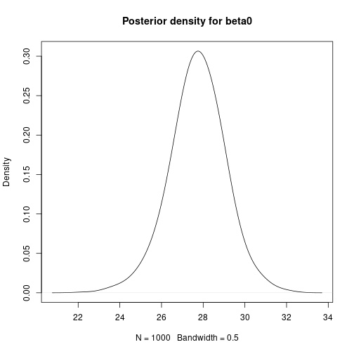
    
    ``` r
    plot(density(results2$beta1, bw = 0.25),
         main = "Posterior density for beta1")
    ```
    
    
    
    ``` r
    plot(density(results2$StdDev, bw = 0.075),
         main = "Posterior density for StdDev")
    ```
    
    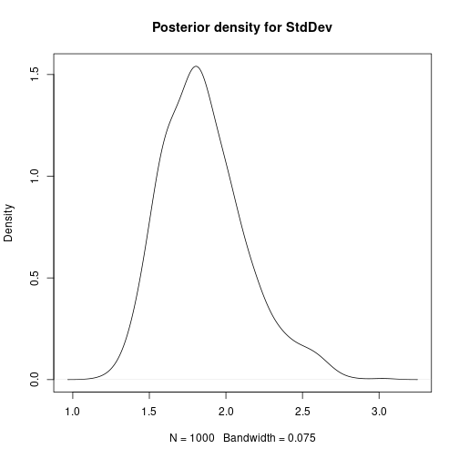
    
    ``` r
    # Plot sampled series
    ts.plot(results2$beta0, ylab = "beta0", xlab = "Iteration")
    ```
    
    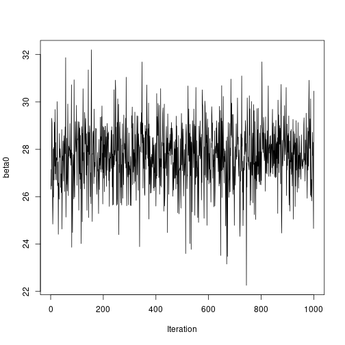
    
    ``` r
    ts.plot(results2$beta1, ylab = "beta1", xlab = "Iteration")
    ```
    
    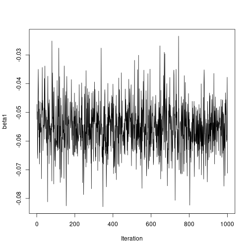
    
    ``` r
    ts.plot(results2$StdDev, ylab = "sigma", xlab = "Iteration")
    ```
    
    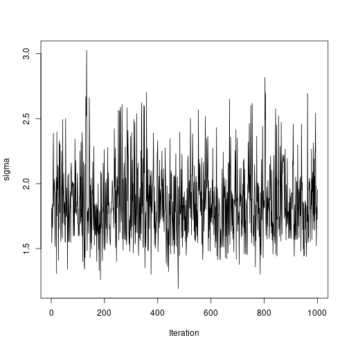
    
    </details>

# INLA

`INLA` (https://www.r-inla.org/) is based on producing (accurate)
approximations to the marginal posterior distributions of the model parameters.
Although this can be enough most of the time, making multivariate inference
with `INLA` can be difficult or impossible. However, in many cases this is
not needed and `INLA` can fit some classes of models in a fraction of the
time it takes with MCMC.

We can obtain Bayesian model fits without using MCMC with the
INLA software, implemented in R via the `INLA` package. If you do not have this
package installed already, as it is not on CRAN you will need to install it via


``` r
install.packages(
  "INLA",
  repos = c(getOption("repos"), INLA="https://inla.r-inla-download.org/R/stable"),
  dep=TRUE
)
```

After this, the package can be loaded into R:

``` r
library(INLA)
```

## Example: Fake News

This section is included here as a reminder, as we are going to reanalyse this
data set using `INLA`.

The `fake_news` data set in the `bayesrules` package in `R` contains
information about 150 news articles, some real news and some fake news.

In this example, we will look at trying to predict whether an article of news
is fake or not given three explanatory variables.

We can use the following code to extract the variables we want from the
data set:


``` r
library(bayesrules)
fakenews <- fake_news[,c("type","title_has_excl","title_words","negative")]
```

The response variable `type` takes values `fake` or `real`, which should be
self-explanatory. The three explanatory variables are:

* `title_has_excl`, whether or not the article contains an exclamation mark
(values `TRUE` or `FALSE`);

* `title_words`, the number of words in the title (a positive integer); and

* `negative`, a sentiment rating, recorded on a continuous scale.

In the exercise to follow, we will examine whether the chance of an article
being fake news is related to the three covariates here.

Note that the variable `title_has_excl` will need to be either replaced by or
converted to a factor, for example


``` r
fakenews$titlehasexcl <- as.factor(fakenews$title_has_excl)
```

Functions `summary` and `confint` produce a summary (including parameter
estimates etc) and confidence intervals for the parameters, respectively.

Finally, we create a new version of the response variable of type logical:

``` r
fakenews$typeFAKE <- fakenews$type == "fake"
```

## Exercises

* Perform an exploratory assessment of the fake news data set, in particular
looking at the possible relationships between the explanatory variables
and the fake/real response variable `typeFAKE`. You may wish to use the R
function `boxplot()` here.

  <details><summary>Solution</summary>
  
  
  ``` r
  # Is there a link between the fakeness and whether the title has an exclamation mark?
  table(fakenews$title_has_excl, fakenews$typeFAKE)
  ```
  
  ```
  ##        
  ##         FALSE TRUE
  ##   FALSE    88   44
  ##   TRUE      2   16
  ```
  
  ``` r
  # For the quantitative variables, look at boxplots on fake vs real
  boxplot(fakenews$title_words ~ fakenews$typeFAKE)
  ```
  
  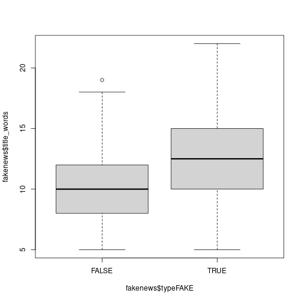
  
  ``` r
  boxplot(fakenews$negative ~ fakenews$typeFAKE)
  ```
  
  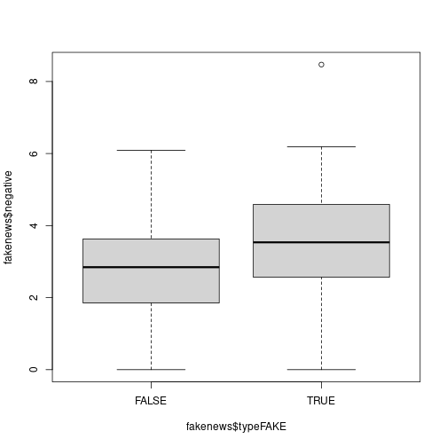
  
  </details>
                   
* Fit the Bayesian model without MCMC using `INLA`; note that the summary output
provides credible intervals for each parameter to help us make inference.
Also, in `INLA` a Binomial response needs to be entered as type integer, so we
need another conversion:

  
  ``` r
  fakenews$typeFAKE.int <- as.integer(fakenews$typeFAKE)
  ```

  <details><summary>Solution</summary>
  
  
  ``` r
  # Fit model - note similarity with bayesx syntax
  inla.output <- inla(formula = typeFAKE.int ~ titlehasexcl + title_words + negative,
                      data = fakenews,
                      family = "binomial")
  # Summarise output
  summary(inla.output)
  ```
  
  ```
  ## Time used:
  ##     Pre = 0.274, Running = 0.172, Post = 0.00536, Total = 0.452 
  ## Fixed effects:
  ##                    mean    sd 0.025quant 0.5quant 0.975quant   mode kld
  ## (Intercept)      -3.016 0.761     -4.507   -3.016     -1.525 -3.016   0
  ## titlehasexclTRUE  2.680 0.791      1.131    2.680      4.230  2.680   0
  ## title_words       0.116 0.058      0.002    0.116      0.230  0.116   0
  ## negative          0.328 0.154      0.027    0.328      0.629  0.328   0
  ## 
  ## Marginal log-Likelihood:  -100.78 
  ##  is computed 
  ## Posterior summaries for the linear predictor and the fitted values are computed
  ## (Posterior marginals needs also 'control.compute=list(return.marginals.predictor=TRUE)')
  ```
  </details>

* Fit a non-Bayesian model using `glm()` for comparison. How do the model fits
compare?

  <details><summary>Solution</summary>
  
  
  ``` r
  # Fit model - note similarity with bayesx syntax
  glm.output <- glm(formula = typeFAKE ~ titlehasexcl + title_words + negative,
                    data = fakenews,
                    family = "binomial")
  # Summarise output
  summary(glm.output)
  ```
  
  ```
  ## 
  ## Call:
  ## glm(formula = typeFAKE ~ titlehasexcl + title_words + negative, 
  ##     family = "binomial", data = fakenews)
  ## 
  ## Coefficients:
  ##                  Estimate Std. Error z value Pr(>|z|)    
  ## (Intercept)      -2.91516    0.76096  -3.831 0.000128 ***
  ## titlehasexclTRUE  2.44156    0.79103   3.087 0.002025 ** 
  ## title_words       0.11164    0.05801   1.925 0.054278 .  
  ## negative          0.31527    0.15371   2.051 0.040266 *  
  ## ---
  ## Signif. codes:  0 '***' 0.001 '**' 0.01 '*' 0.05 '.' 0.1 ' ' 1
  ## 
  ## (Dispersion parameter for binomial family taken to be 1)
  ## 
  ##     Null deviance: 201.90  on 149  degrees of freedom
  ## Residual deviance: 169.36  on 146  degrees of freedom
  ## AIC: 177.36
  ## 
  ## Number of Fisher Scoring iterations: 4
  ```
  
  ``` r
  # Perform ANOVA on each variable in turn
  drop1(glm.output,test="Chisq")
  ```
  
  ```
  ## Single term deletions
  ## 
  ## Model:
  ## typeFAKE ~ titlehasexcl + title_words + negative
  ##              Df Deviance    AIC     LRT  Pr(>Chi)    
  ## <none>            169.36 177.36                      
  ## titlehasexcl  1   183.51 189.51 14.1519 0.0001686 ***
  ## title_words   1   173.17 179.17  3.8099 0.0509518 .  
  ## negative      1   173.79 179.79  4.4298 0.0353162 *  
  ## ---
  ## Signif. codes:  0 '***' 0.001 '**' 0.01 '*' 0.05 '.' 0.1 ' ' 1
  ```
  
  </details>
                                                     
## Example: Emergency Room Complaints

This section is included here as a reminder, as we are going to reanalyse this
data set using `INLA`.

For this example we will use the `esdcomp` data set, which is available in the
`faraway` package. This data set records complaints about emergency room
doctors.  In particular, data was recorded on 44 doctors working in an
emergency service at a hospital to study the factors affecting the number of
complaints received.

The response variable that we will use is `complaints`, an integer count of the
number of complaints received. It is expected that the number of complaints will
scale by the number of visits (contained in the `visits` column), so we are
modelling the rate of complaints per visit - thus we will need to include a new
variable `log.visits` as an offset.

The three explanatory variables we will use in the analysis are:

* `residency`, whether or not the doctor is still in residency training
(values `N` or `Y`);

* `gender`, the gender of the doctor (values `F` or `M`); and

* `revenue`, dollars per hour earned by the doctor, recorded as an integer.

Our simple aim here is to assess whether the seniority, gender or income of the
doctor is linked with the rate of complaints against that doctor.

We can use the following code to extract the data we want without having to load
the whole package:


``` r
esdcomp <- faraway::esdcomp
```

## Fitting Bayesian Poisson Regression Models

Again we can use `INLA` to fit this form of Bayesian generalised
linear model.

If not loaded already, the package must be loaded into R:


As noted above we need to include an offset in this analysis; since
for a Poisson GLM we will be using a log() link function by default, we must
compute the log of the number of visits and include that in the data set
`esdcomp`:


``` r
esdcomp$log.visits <- log(esdcomp$visits)
```

The offset term in the model is then written

`offset(log.visits)`

## Exercises

* Perform an exploratory assessment of the emergency room complaints data set,
particularly how the response variable `complaints` varies with the proposed
explanatory variables relative to the number of visits. To do this, create
another variable which is the ratio of `complaints` to `visits`.

  <details><summary>Solution</summary>
  
  
  ``` r
  # Compute the ratio
  esdcomp$ratio <- esdcomp$complaints / esdcomp$visits
  # Plot the link with revenue
  plot(esdcomp$revenue,esdcomp$ratio)
  ```
  
  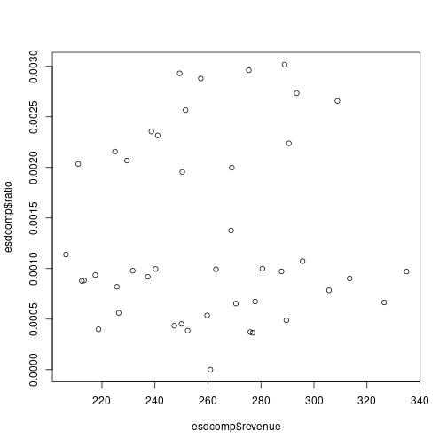
  
  ``` r
  # Use boxplots against residency and gender
  boxplot(esdcomp$ratio ~ esdcomp$residency)
  ```
  
  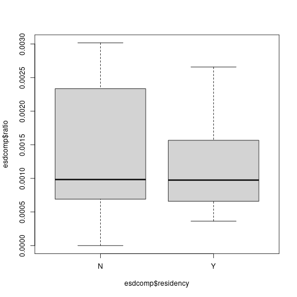
  
  ``` r
  boxplot(esdcomp$ratio ~ esdcomp$gender)
  ```
  
  
  
  </details>

* Fit the Bayesian model without MCMC using `INLA`; note that the summary output
provides credible intervals for each parameter to help us make inference.

  <details><summary>Solution</summary>
  
  
  ``` r
  # Fit model - note similarity with bayesx syntax
  inla.output <- inla(formula = complaints ~ offset(log.visits) + residency + gender + revenue,
                      data = esdcomp,
                      family = "poisson")
  # Summarise output
  summary(inla.output)
  ```
  
  ```
  ## Time used:
  ##     Pre = 0.129, Running = 0.145, Post = 0.061, Total = 0.335 
  ## Fixed effects:
  ##               mean    sd 0.025quant 0.5quant 0.975quant   mode kld
  ## (Intercept) -7.171 0.688     -8.520   -7.171     -5.822 -7.171   0
  ## residencyY  -0.354 0.191     -0.728   -0.354      0.021 -0.354   0
  ## genderM      0.139 0.214     -0.281    0.139      0.559  0.139   0
  ## revenue      0.002 0.003     -0.003    0.002      0.008  0.002   0
  ## 
  ## Marginal log-Likelihood:  -111.90 
  ##  is computed 
  ## Posterior summaries for the linear predictor and the fitted values are computed
  ## (Posterior marginals needs also 'control.compute=list(return.marginals.predictor=TRUE)')
  ```
  
  </details>

* Fit a non-Bayesian model using `glm()` for comparison. How do the model fits
compare?

  <details><summary>Solution</summary>

  
  ``` r
  # Fit model - note similarity with bayesx syntax
  esdcomp$log.visits <- log(esdcomp$visits)
  glm.output <- glm(formula = complaints ~ offset(log.visits) + residency + gender + revenue,
                    data = esdcomp,
                    family = "poisson")
  # Summarise output
  summary(glm.output)
  ```
  
  ```
  ## 
  ## Call:
  ## glm(formula = complaints ~ offset(log.visits) + residency + gender + 
  ##     revenue, family = "poisson", data = esdcomp)
  ## 
  ## Coefficients:
  ##              Estimate Std. Error z value Pr(>|z|)    
  ## (Intercept) -7.157087   0.688148 -10.401   <2e-16 ***
  ## residencyY  -0.350610   0.191077  -1.835   0.0665 .  
  ## genderM      0.128995   0.214323   0.602   0.5473    
  ## revenue      0.002362   0.002798   0.844   0.3986    
  ## ---
  ## Signif. codes:  0 '***' 0.001 '**' 0.01 '*' 0.05 '.' 0.1 ' ' 1
  ## 
  ## (Dispersion parameter for poisson family taken to be 1)
  ## 
  ##     Null deviance: 63.435  on 43  degrees of freedom
  ## Residual deviance: 58.698  on 40  degrees of freedom
  ## AIC: 189.48
  ## 
  ## Number of Fisher Scoring iterations: 5
  ```
  
  ``` r
  # Perform ANOVA on each variable in turn
  drop1(glm.output, test = "Chisq")
  ```
  
  ```
  ## Single term deletions
  ## 
  ## Model:
  ## complaints ~ offset(log.visits) + residency + gender + revenue
  ##           Df Deviance    AIC    LRT Pr(>Chi)  
  ## <none>         58.698 189.48                  
  ## residency  1   62.128 190.91 3.4303  0.06401 .
  ## gender     1   59.067 187.85 0.3689  0.54361  
  ## revenue    1   59.407 188.19 0.7093  0.39969  
  ## ---
  ## Signif. codes:  0 '***' 0.001 '**' 0.01 '*' 0.05 '.' 0.1 ' ' 1
  ```
  
  </details>

# Bayesian Hierarchical Modelling

These two final sections simply reproduce Practical 7, but using `INLA` rather
than `BayesX`.

# Linear Mixed Models

Linear mixed models were defined in the lecture as follows:

$$
Y_{ij} = X_{ij}\beta +\phi_i+\epsilon_{ij}
$$

Here, $Y_{ij}$ represents observation $j$ in group $i$, $X_{ij}$ is a vector of
covariates with coefficients $\beta$, $\phi_i$ i.i.d. random effects and
$\epsilon_{ij}$ a Gaussian error term. The distribution of the random effects
$\phi_i$ is Gaussian with zero mean and precision $\tau_{\phi}$.


# Multilevel Modelling

Multilevel models are a particular type of mixed-effects models in which
observations are nested within groups, so that group effects are modelled using
random effects. A typical example is that of students nested within classes.

For the next example, the `nlschools` data set (in package `MASS`) will be used.
This data set records data about students' performance (in particular, about a
language score test) and other variables. The variables in this data set are:

* `lang`, language score test.

* `IQ`, verbal IQ.

* `class`, class ID.

* `GS`, class size as number of eighth-grade pupils recorded in the class.

* `SES`, social-economic status of pupil’s family.

* `COMB`, whether the pupils are taught in the multi-grade class with 7th-grade students.

The data set can be loaded and summarised as follows:


``` r
library(MASS)
data("nlschools")
summary(nlschools)
```

```
##       lang             IQ            class            GS             SES        COMB    
##  Min.   : 9.00   Min.   : 4.00   15580  :  33   Min.   :10.00   Min.   :10.00   0:1658  
##  1st Qu.:35.00   1st Qu.:10.50   5480   :  31   1st Qu.:23.00   1st Qu.:20.00   1: 629  
##  Median :42.00   Median :12.00   15980  :  31   Median :27.00   Median :27.00           
##  Mean   :40.93   Mean   :11.83   16180  :  31   Mean   :26.51   Mean   :27.81           
##  3rd Qu.:48.00   3rd Qu.:13.00   18380  :  31   3rd Qu.:31.00   3rd Qu.:35.00           
##  Max.   :58.00   Max.   :18.00   5580   :  30   Max.   :39.00   Max.   :50.00           
##                                  (Other):2100
```

The model to fit will take `lang` as the response variable and include
`IQ`, `GS`, `SES` and `COMB` as covariates (i.e., fixed effects). This model
can easily be fit with `INLA` as follows:


``` r
library(INLA)
m1 <- inla(lang ~ IQ + GS +  SES + COMB, data = nlschools)

summary(m1)
```

```
## Time used:
##     Pre = 0.13, Running = 0.163, Post = 0.0111, Total = 0.305 
## Fixed effects:
##               mean    sd 0.025quant 0.5quant 0.975quant   mode kld
## (Intercept)  9.685 1.070      7.586    9.685     11.784  9.685   0
## IQ           2.391 0.074      2.246    2.391      2.536  2.391   0
## GS          -0.026 0.025     -0.076   -0.026      0.024 -0.026   0
## SES          0.148 0.014      0.120    0.148      0.175  0.148   0
## COMB1       -1.684 0.325     -2.322   -1.684     -1.047 -1.684   0
## 
## Model hyperparameters:
##                                          mean    sd 0.025quant 0.5quant 0.975quant  mode
## Precision for the Gaussian observations 0.021 0.001       0.02    0.021      0.022 0.021
## 
## Marginal log-Likelihood:  -7713.44 
##  is computed 
## Posterior summaries for the linear predictor and the fitted values are computed
## (Posterior marginals needs also 'control.compute=list(return.marginals.predictor=TRUE)')
```

Note that the previous model only includes fixed effects. The data set includes
`class` as the class ID to which each student belongs. Class effects can have an
impact on the performance of the students, with students in the same class
performing similarly in the language test.

Very conveniently, `INLA` can include random effects in the model by adding a
term in the right hand side of the formula that defined the model. Specifically, 
the term to add is `f(class, model = "iid")` (see code below for the
full model).
This will create a random effect indexed over variable `class` and which is of
type `iid`, i.e., the random effects are independent and identically distributed
using a normal distribution with zero mean and precision $\tau$.

Before fitting the model, the between-class variability can be explored by
means of boxplots:


``` r
boxplot(lang ~ class, data = nlschools, las = 2)
```

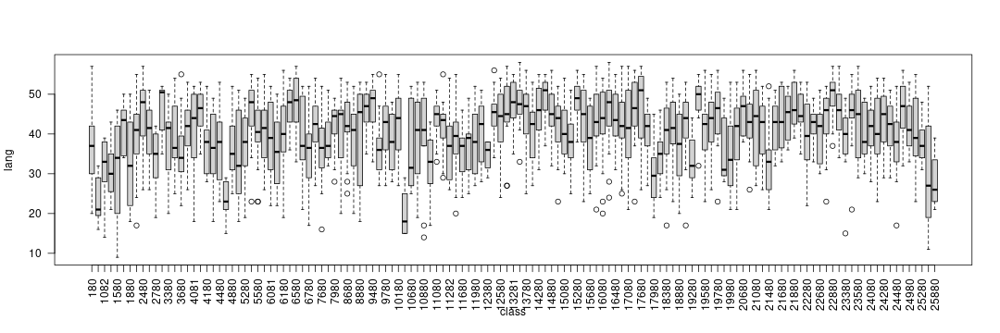

The code to fit the model with random effects is:


``` r
m2 <- inla(
  lang ~ IQ + GS +  SES + COMB + f(class, model = "iid"),
  data = nlschools
)

summary(m2)
```

```
## Time used:
##     Pre = 0.814, Running = 0.19, Post = 0.0219, Total = 1.03 
## Fixed effects:
##               mean    sd 0.025quant 0.5quant 0.975quant   mode kld
## (Intercept) 10.626 1.495      7.698   10.624     13.565 10.624   0
## IQ           2.248 0.072      2.108    2.248      2.388  2.248   0
## GS          -0.016 0.047     -0.109   -0.016      0.078 -0.016   0
## SES          0.165 0.015      0.136    0.165      0.194  0.165   0
## COMB1       -2.017 0.598     -3.193   -2.016     -0.847 -2.016   0
## 
## Random effects:
##   Name	  Model
##     class IID model
## 
## Model hyperparameters:
##                                          mean    sd 0.025quant 0.5quant 0.975quant  mode
## Precision for the Gaussian observations 0.025 0.001      0.024    0.025      0.027 0.025
## Precision for class                     0.122 0.020      0.087    0.121      0.167 0.118
## 
## Marginal log-Likelihood:  -7613.01 
##  is computed 
## Posterior summaries for the linear predictor and the fitted values are computed
## (Posterior marginals needs also 'control.compute=list(return.marginals.predictor=TRUE)')
```


# Generalised Linear Mixed Models

Mixed effects models can also be considered within the context of generalised 
linear models. In this case, the linear predictor of observation $i$, $\eta_i$,
can be defined as

$$
\eta_i = X_{ij}\beta +\phi_i
$$

Compared to the previous setting of linear mixed effects models, note that now
the distribution of the response could be other than Gaussian and that
observations are not necessarily nested within groups.

# Poisson regression


In this practical we will use the North Carolina Sudden Infant Death Syndrome
(SIDS) data set. It is available in the `spData` package and it can be loaded
using:


``` r
library(spData)
data(nc.sids)
summary(nc.sids)
```

```
##     CNTY.ID         BIR74           SID74          NWBIR74           BIR79           SID79      
##  Min.   :1825   Min.   :  248   Min.   : 0.00   Min.   :   1.0   Min.   :  319   Min.   : 0.00  
##  1st Qu.:1902   1st Qu.: 1077   1st Qu.: 2.00   1st Qu.: 190.0   1st Qu.: 1336   1st Qu.: 2.00  
##  Median :1982   Median : 2180   Median : 4.00   Median : 697.5   Median : 2636   Median : 5.00  
##  Mean   :1986   Mean   : 3300   Mean   : 6.67   Mean   :1051.0   Mean   : 4224   Mean   : 8.36  
##  3rd Qu.:2067   3rd Qu.: 3936   3rd Qu.: 8.25   3rd Qu.:1168.5   3rd Qu.: 4889   3rd Qu.:10.25  
##  Max.   :2241   Max.   :21588   Max.   :44.00   Max.   :8027.0   Max.   :30757   Max.   :57.00  
##     NWBIR79             east           north             x                 y       
##  Min.   :    3.0   Min.   : 19.0   Min.   :  6.0   Min.   :-328.04   Min.   :3757  
##  1st Qu.:  250.5   1st Qu.:178.8   1st Qu.: 97.0   1st Qu.: -60.55   1st Qu.:3920  
##  Median :  874.5   Median :285.0   Median :125.5   Median : 114.38   Median :3963  
##  Mean   : 1352.8   Mean   :271.3   Mean   :122.1   Mean   :  91.46   Mean   :3953  
##  3rd Qu.: 1406.8   3rd Qu.:361.2   3rd Qu.:151.5   3rd Qu.: 240.03   3rd Qu.:4000  
##  Max.   :11631.0   Max.   :482.0   Max.   :182.0   Max.   : 439.65   Max.   :4060  
##       lon              lat             L.id           M.id     
##  Min.   :-84.08   Min.   :33.92   Min.   :1.00   Min.   :1.00  
##  1st Qu.:-81.20   1st Qu.:35.26   1st Qu.:1.00   1st Qu.:2.00  
##  Median :-79.26   Median :35.68   Median :2.00   Median :3.00  
##  Mean   :-79.51   Mean   :35.62   Mean   :2.12   Mean   :2.67  
##  3rd Qu.:-77.87   3rd Qu.:36.05   3rd Qu.:3.00   3rd Qu.:3.25  
##  Max.   :-75.67   Max.   :36.52   Max.   :4.00   Max.   :4.00
```

A full description of the data set is provided in the associated manual page
(check with `?nc.sids`) but in this practical we will only consider these
variables:

* `BIR74`,  number of births (1974-78).

* `SID74`,  number of SID deaths (1974-78).

* `NWBIR74`, number of non-white births (1974-78).

These variables are measured at the county level in North Carolina, of which
there are 100.

Because `SID74` records the number of SID deaths, the model is Poisson:

$$
O_i \mid \mu_i \sim Po(\mu_i),\ i=1,\ldots, 100
$$
Here, $O_i$ represents the number of cases in county $i$ and $\mu_i$ the mean.
In addition, mean $\mu_i$ will be written as $\mu_i = E_i \theta_i$, where $E_i$
is the *expected* number of cases and $\theta_i$ the relative risk in county $i$.

The relative risk $\theta_i$ is often modelled, on the log-scale, to be equal
to a linear predictor:

$$
\log(\theta_i) = \beta_0 + \ldots
$$

The expected number of cases is computed by multiplying the number of births in
county $i$ to the overall mortality rate

$$
r = \frac{\sum_{i=1}^{100}O_i}{\sum_{i=1}^{100}B_i}
$$
where $B_i$ represents the total number of births in country $i$. Hence,
the expected number of cases in county $i$ is $E_i = r B_i$.


``` r
# Overall mortality rate
r74 <- sum(nc.sids$SID74) / sum(nc.sids$BIR74)
# Expected cases
nc.sids$EXP74 <- r74 * nc.sids$BIR74
```

A common measure of relative risk is the *standardised mortality ratio*
($O_i / E_i$):


``` r
nc.sids$SMR74 <- nc.sids$SID74 / nc.sids$EXP74
```

A summary of the SMR can be obtained:


``` r
hist(nc.sids$SMR, xlab = "SMR")
```

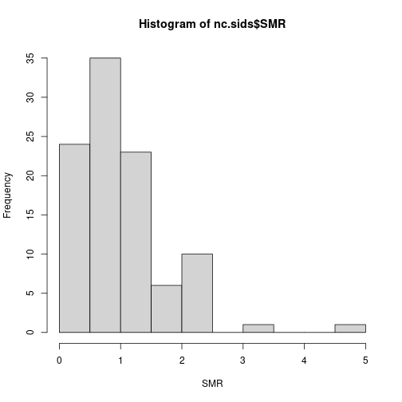

Values above 1 indicate that the county has more observed deaths than expected
and that there might be an increased risk in the area.


As a covariate, we will compute the proportion of non-white births:


``` r
nc.sids$NWPROP74 <- nc.sids$NWBIR74/ nc.sids$BIR74
```

There is a clear relationship between the SMR and the proportion of non-white
births in a county:


``` r
plot(nc.sids$NWPROP74, nc.sids$SMR74)
```

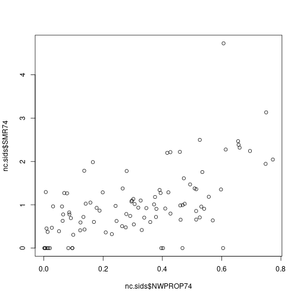

``` r
# Correlation
cor(nc.sids$NWPROP74, nc.sids$SMR74)
```

```
## [1] 0.5793901
```


A simple Poisson regression can be fit by using the following code:


``` r
m1nc <- inla(
  SID74 ~ 1 + NWPROP74,
  family = "poisson",
  E = nc.sids$EXP74,
  data = nc.sids
)
summary(m1nc)
```

```
## Time used:
##     Pre = 0.314, Running = 0.148, Post = 0.00488, Total = 0.467 
## Fixed effects:
##               mean    sd 0.025quant 0.5quant 0.975quant   mode kld
## (Intercept) -0.647 0.090     -0.824   -0.647     -0.471 -0.647   0
## NWPROP74     1.867 0.217      1.441    1.867      2.293  1.867   0
## 
## Marginal log-Likelihood:  -226.13 
##  is computed 
## Posterior summaries for the linear predictor and the fitted values are computed
## (Posterior marginals needs also 'control.compute=list(return.marginals.predictor=TRUE)')
```

Random effects can also be included to account for intrinsic differences between
the counties:


``` r
# Index for random effects
nc.sids$ID <- seq_len(nrow(nc.sids))

# Model WITH covariate
m2nc <- inla(
  SID74 ~  1 + NWPROP74 + f(ID, model = "iid"),
  family = "poisson",
  E = nc.sids$EXP74,
  data = as.data.frame(nc.sids)
)

summary(m2nc)
```

```
## Time used:
##     Pre = 0.138, Running = 0.157, Post = 0.00974, Total = 0.305 
## Fixed effects:
##               mean    sd 0.025quant 0.5quant 0.975quant   mode kld
## (Intercept) -0.650 0.104     -0.856   -0.649     -0.446 -0.649   0
## NWPROP74     1.883 0.254      1.386    1.882      2.385  1.882   0
## 
## Random effects:
##   Name	  Model
##     ID IID model
## 
## Model hyperparameters:
##                   mean     sd 0.025quant 0.5quant 0.975quant  mode
## Precision for ID 89.43 142.78       9.45    28.92     273.93 15.69
## 
## Marginal log-Likelihood:  -227.82 
##  is computed 
## Posterior summaries for the linear predictor and the fitted values are computed
## (Posterior marginals needs also 'control.compute=list(return.marginals.predictor=TRUE)')
```

The role of the covariate can be explored by fitting a model without it:


``` r
# Model WITHOUT covariate
m3nc <- inla(
  SID74 ~  1 + f(ID, model = "iid"),
  family = "poisson",
  E = nc.sids$EXP74,
  data = as.data.frame(nc.sids)
)

summary(m3nc)
```

```
## Time used:
##     Pre = 0.145, Running = 0.166, Post = 0.00903, Total = 0.32 
## Fixed effects:
##               mean    sd 0.025quant 0.5quant 0.975quant   mode kld
## (Intercept) -0.029 0.063     -0.156   -0.028      0.091 -0.028   0
## 
## Random effects:
##   Name	  Model
##     ID IID model
## 
## Model hyperparameters:
##                  mean   sd 0.025quant 0.5quant 0.975quant mode
## Precision for ID 7.26 2.57       3.79     6.77      13.55 6.01
## 
## Marginal log-Likelihood:  -245.52 
##  is computed 
## Posterior summaries for the linear predictor and the fitted values are computed
## (Posterior marginals needs also 'control.compute=list(return.marginals.predictor=TRUE)')
```

Now, notice the decrease in the estimate of the precision of the random effects
(i.e., the variance increases). This means that values of the random effects
are now larger than in the previous case as the random effects pick some of the
effect explained by the covariate.


``` r
oldpar <- par(mfrow = c(1, 2))
boxplot(m2nc$summary.random$ID$mean, ylim = c(-1, 1), main = "With NWPROP74")
boxplot(m3nc$summary.random$ID$mean, ylim = c(-1, 1), main = "Without NWPROP74")
par(oldpar)
```

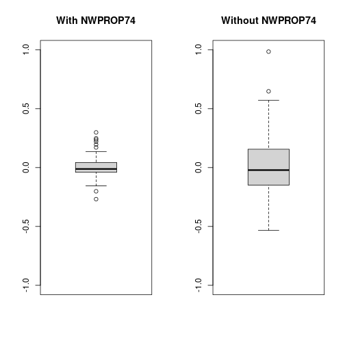
